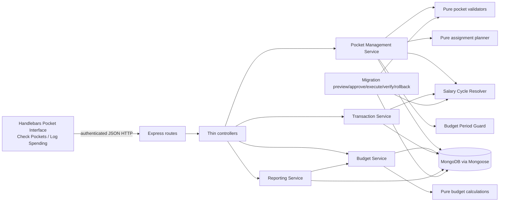
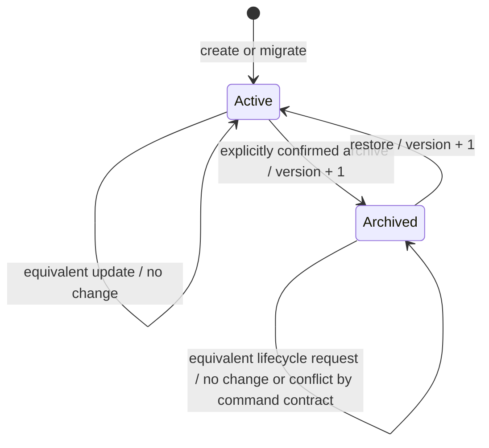

# Technical Design Document

## Overview

Pocket Management replaces the fixed `utils/constants.js#POCKETS` catalogue with durable pocket definitions and explicit per-`Budget_Month` assignments while preserving Money Journal’s current salary-cycle semantics and historical outputs. The design extends the existing Node.js/Express, Mongoose/MongoDB, Handlebars, browser-JavaScript, and Tailwind architecture; it does not introduce a new application framework.

The central design decision is to separate reusable intent from historical fact:

- `PocketDefinition` owns the current reusable name, emoji, cadence, default amount, lifecycle, audit fields, and optimistic version.
- `PocketAssignment` owns the immutable identity link to one pocket and one named `Budget_Month`, plus snapshots of the definition fields, selected amount mode, and the complete monthly or weekly allocation set used for that month.
- Transactions reference immutable `pocketId` values and are validated against assignments for the transaction’s server-derived `Budget_Month`.
- Budget and reporting reads use assignment snapshots, never the current definition, when presenting saved periods.

This design is grounded in the approved requirements and the repository’s established conventions: injectable service/controller/router factories, server-authoritative salary-cycle resolution, `withOpenBudgetPeriods` fencing, typed domain errors, request correlation IDs, dependency-injected clocks and models, `node:test`, `fast-check`, `supertest`, `jsdom`, and replica-set-capable MongoDB integration fixtures.

### Goals

- Let a Wife-role user create, update, archive, and restore managed pocket definitions.
- Let a Wife-role user explicitly assign active pockets to the active or immediately following open `Budget_Month` using default or custom monthly/weekly values.
- Preserve assignment snapshots, expense references, closed-month history, audit identity, and totals after later definition changes.
- Make assignment confirmation atomic, idempotent, version-aware, and safe under concurrent requests.
- Replace all runtime dependence on the fixed `POCKETS` map after verified migration while retaining a reversible compatibility window.
- Integrate managed identities with Check Pockets, Log Spending, Monthly Story, Review History, and existing report APIs.
- Meet the responsive, keyboard, focus, contrast, reduced-motion, and status-feedback requirements of the Pocket Interface.

### Non-goals

- Changing salary-cycle payday rules, ISO week rules, household membership, session authentication, or Wife-role semantics.
- Adding recurring carryover, automatic assignment of every active pocket, or allocation forecasting.
- Rewriting a confirmed assignment when its definition changes.
- Hard-deleting a pocket definition or deleting assignments that have attributed spending.
- Replacing Express, Mongoose, MongoDB, Handlebars, Tailwind, Chart.js, or the existing test runner.

### Current-code findings

- Fixed pockets appear in `utils/constants.js`, Mongoose `enum` constraints in `PocketBudget`, `PocketBudgetCadence`, `WeeklyAllocation`, and `Transaction`, and hard-coded controls in `log-spending.hbs` and `log-spending.js`. All must transition together; removing only the constant would break schema validation and browser selection.
- `BudgetService` already centralizes salary-cycle periods, editable-window checks, closed-period transaction fencing, monthly/weekly attribution, and injected model dependencies. Pocket Management should reuse those modules rather than recalculate periods.
- Current budgeting uses three collections (`pocketbudgets`, `pocketbudgetcadences`, `weeklyallocations`) and renders every fixed pocket, substituting zero when no allocation exists. The approved feature instead renders only explicit assignments and treats zero assignments as an intentional empty state.
- `TransactionService` already stores server-derived `budgetMonth`/`budgetYear`, supports split shares, and protects writes with open-period fences. Its remaining fixed-name validation becomes assignment-backed `pocketId` validation.
- `MigrationService` already has preview, approval, source fingerprints, preservation checks, transactional execution, verification, rollback, bounded preview sizes, and operator authorization. Pocket migration extends this lifecycle rather than adding an immediate-write script.
- `middleware/errorHandler.js` already correlates requests and prevents financial/request payloads from entering client error details or logs. New errors must use the same typed adapter and safe-detail allowlist.
- `test/helpers/property.js` configures `fast-check` for at least 100 runs with reproducible seed/shrink output; the new properties use that helper.

### Research findings informing the design

- Mongoose transactions group multiple operations so failures abort the unit of work; the design therefore commits assignment documents, guard fencing, and compatibility projections together ([Mongoose transactions](https://mongoosejs.com/docs/transactions.html)).
- A unique compound index enforces uniqueness for a complete key combination; this is the database-level arbiter for normalized pocket names and `(pocketId, Budget_Month)` assignments under races ([MongoDB compound unique indexes](https://www.mongodb.com/docs/manual/core/index-unique/create-compound/)).
- `Intl.Segmenter` returns locale-aware string segments and supports grapheme granularity. Emoji validation uses one grapheme cluster plus an emoji-property check rather than UTF-16 length, so joined and skin-tone emoji remain one user-perceived emoji ([MDN `Intl.Segmenter`](https://developer.mozilla.org/en-US/docs/Web/JavaScript/Reference/Global_Objects/Intl/Segmenter)).
- WCAG guidance supports visible focus differentiation and adequately sized controls. The design keeps the requirement’s stronger 44-by-44-pixel mobile primary targets, 3:1 non-text/focus contrast, and 4.5:1 normal-text contrast ([focus appearance](https://www.w3.org/WAI/WCAG22/Understanding/focus-appearance.html), [target size](https://www.w3.org/WAI/WCAG22/Understanding/target-size-minimum)).
- `fast-check` exposes run count, seeds, size, and failure reporting; the repository’s shared helper remains the standard configuration point for reproducible generated tests ([fast-check configuration](https://fast-check.dev/docs/configuration/)).

Content was rephrased for compliance with licensing restrictions.

### Requirement coverage summary

| Concern | Design location |
|---|---|
| Definition creation, validation, view, update, archive, restore | PocketDefinition model; PocketManagementService; definition APIs; lifecycle UI |
| Assignment setup and default/custom monthly/weekly amounts | Assignment planner; PocketAssignment model; setup APIs and staged UI |
| History, budgeting, expenses, split attribution | Assignment snapshot reads; BudgetService, TransactionService, ReportingService integration |
| Authentication, authorization, editable window, closed months | Route middleware plus service authorization; salary-cycle resolver; period guard |
| Idempotence, versions, concurrency, rollback | Unique indexes; compare-and-set writes; canonical equality; MongoDB transactions |
| Responsive and accessible interface | Handlebars shell, browser state module, dialogs, validation/status regions, responsive layout |
| Legacy migration and rollout | Extended migration lifecycle; compatibility projections; feature flag; verification and rollback |

## Architecture

### Logical architecture



The route/controller/service layering follows the existing factories. Controllers only map request fields and status codes. Services authenticate actors, enforce domain policy, own database sessions, and return canonical DTOs. Pure modules handle normalization, emoji/name/amount validation, allocation planning, equality, sorting, and calculations. This keeps universal behavior testable without MongoDB.

### Source of truth and read precedence

When `POCKET_MANAGEMENT_ENABLED` is on and migration is verified:

1. `PocketDefinition` is authoritative for current management and new selection.
2. `PocketAssignment` is authoritative for a saved `Budget_Month` and all historical labels, cadence, mode, and allocation values.
3. Transaction `pocketId` and split-share `pocketId` fields are authoritative references; each is resolved through the assignment for the stored transaction month.
4. Existing `pocket`, monthly budget, cadence, and weekly allocation fields/collections are compatibility projections only and never override managed records.

When the flag is off, existing readers continue using fixed-name fields and legacy collections. During a guarded dual-read stage, a managed assignment is preferred when present; absence falls back to the legacy source only for records not yet migrated. Verification forbids ambiguous double sources before final activation.

### Definition lifecycle



Archiving changes availability, not identity. Archived definitions are excluded from new assignment selection. They remain resolvable through existing assignments and may appear in expense selection only for months where they are already assigned. Archived definitions cannot be edited until restored.

### Assignment confirmation transaction

Assignment setup is client-staged but server-planned. Opening setup returns active definitions plus existing assignment state. Selection, mode switches, and amount editing do not write. Confirmation sends a canonical list of selected assignment commands and expected versions.

```mermaid
sequenceDiagram
    participant UI as Pocket Interface
    participant C as Pocket Controller
    participant S as PocketManagementService
    participant G as BudgetPeriodGuard
    participant D as Definitions
    participant A as Assignments

    UI->>C: POST /api/pocket-assignments/confirm
    C->>S: budgetMonth, entries, actor
    S->>S: validate shape, duplicates, amounts, versions
    S->>D: read referenced definitions
    S->>S: derive intersecting ISO weeks and complete plans
    S->>G: transaction: fence selected open Budget_Month
    S->>D: re-read lifecycle/version-sensitive inputs in session
    S->>A: compare-and-set inserts/updates; no-op equals
    A-->>S: complete persisted assignment set
    S-->>C: assignments + combined total after commit
    C-->>UI: canonical saved state
```

The service validates every independently evaluable entry first and returns an ordered error array. It then revalidates lifecycle, versions, month state, and unique keys inside the transaction. Any error aborts all assignment changes. Existing assignments omitted from confirmation are preserved; removal is a separate explicitly confirmed command, preventing omission from becoming accidental deletion.

### Concurrency model

- Definition updates, archive, and restore use compare-and-set filters containing `_id` and the submitted `version`. A changed record increments `version` exactly once; an equivalent update returns the current record unchanged.
- Definition name uniqueness is enforced by a unique index on `normalizedName`, covering active and archived records. Concurrent equivalent names have one commit winner; later requests map duplicate-key failure to `POCKET_NAME_CONFLICT`.
- Assignments use a unique index on `(pocketId, budgetYear, budgetMonth)`. Existing updates compare the expected version and canonical assignment content. Equivalent concurrent creates/updates return the committed document without increment; differing late requests return `VERSION_CONFLICT` with the current safe version.
- All writes affecting a `Budget_Month` use the existing `withOpenBudgetPeriods` fence inside the same MongoDB transaction. Close/reopen races therefore serialize against assignment and removal commands.
- Transaction operations are sequential inside a Mongoose session. Retry is limited to transient database transaction labels and duplicate-create reconciliation; business conflicts are never blindly retried.

### Security boundaries

- `requireAuthenticated` protects the Pocket Interface and all pocket APIs; unauthenticated API responses contain no household, audit, assignment, or allocation data.
- Read endpoints permit authenticated household members. Definition, assignment, archive/restore, and removal mutations require Wife role in route middleware and again in the service.
- The server ignores client-supplied creator/updater/timestamps, status, snapshots, totals, derived weeks, and `pocketId` aliases. It derives all of them from actor/session and persisted state.
- Error details expose only safe identifiers needed for recovery: field paths, `budgetMonth`, duplicate entry positions, `pocketId` when authorized, and current version. Financial values, names from unauthorized records, request bodies, session data, and stack traces are excluded.

## Components and Interfaces

### 1. Pocket validators and canonicalization

A pure `pocketValidation` module provides one implementation for runtime commands and migration:

```text
normalizePocketName(value) -> { name, normalizedName }
validatePocketEmoji(value) -> canonical emoji string
validateCadence(value) -> "Monthly" | "Weekly"
validateRupiah(value, field) -> integer in [0, 999999999999]
validateDefinitionFields(input, mode) -> { value, errors[] }
canonicalizeAssignment(input, definition, budgetMonth, weeks) -> AssignmentPlan | errors[]
```

Name normalization trims leading/trailing whitespace, collapses each internal whitespace sequence to one ASCII space, and applies locale-independent lowercase for uniqueness. Length validation counts Unicode code points after trimming and accepts 1–50 characters. The persisted display name is trimmed but otherwise preserves internal user text; `normalizedName` holds the comparison form.

Emoji validation first requires a string, then segments with `Intl.Segmenter(undefined, { granularity: 'grapheme' })` and requires exactly one non-whitespace cluster. The cluster must contain an Extended Pictographic or Emoji Presentation code point; variation selectors, zero-width joiners, regional-indicator pairs, keycap components, and skin-tone modifiers are allowed only as part of that single cluster. Validation is shared server-side; client validation is advisory.

Validation produces deterministic field paths and accumulates all field errors. Update mode validates only supplied mutable fields, while create mode reports every missing/null required field. No persistence query runs if shape validation fails.

### 2. PocketManagementService

The service follows the dependency-injected facade convention used by `createBudgetService` and `createTransactionService`:

```text
createPocketDefinition(command, actor, options) -> PocketDefinitionDTO
listPocketDefinitions(query, actor, options) -> { active[], archived?[] }
updatePocketDefinition(pocketId, command, actor, options) -> PocketDefinitionDTO
archivePocketDefinition(pocketId, command, actor, options) -> LifecycleDTO
restorePocketDefinition(pocketId, command, actor, options) -> LifecycleDTO
getAssignmentSetup(budgetMonth, actor, options) -> AssignmentSetupDTO
confirmAssignments(command, actor, options) -> AssignmentResultDTO
removeAssignment(pocketId, budgetMonth, command, actor, options) -> RemovalDTO
listExpensePocketOptions(expenseDate|budgetMonth, actor, options) -> ExpensePocketDTO[]
```

#### Definition commands

Creation validates all fields, derives normalized name, starts a transaction, inserts one record with version 1 and actor audit fields, and returns the persisted DTO only after commit. No unrelated record is written.

Update loads the authorized definition, validates supplied fields, computes a canonical patch, and checks submitted version. If every supplied value equals storage, it returns the stored record without changing audit/version fields. Otherwise it conditionally updates only mutable fields, updater, `updatedAt`, and version. Definition changes never cascade into existing assignments.

Archive requires `{ confirmed: true, version }` for the identified pocket. Restore requires the expected version. Both conditionally update lifecycle/audit/version and preserve all references. Archive confirmation is enforced in the service even if a non-browser client calls it.

#### Assignment setup read

`getAssignmentSetup` validates the month, derives its salary-cycle period and intersecting ISO weeks, reads all active definitions plus existing assignments, and returns each active definition exactly once in normalized-name/id order. A definition is marked `assigned` when the unique month assignment exists, otherwise `unassigned`. Existing archived assignments are returned in an `assignedArchived` collection for history/removal visibility but are not selectable as new entries. The DTO contains `unassignedCount`, server `canEdit`, `isClosed`, and no implicit assignments.

#### Assignment planning

For every selected entry:

- `Use_Default + Monthly` creates one embedded allocation `{ kind: "Monthly", key: "monthly", amount: definition.defaultAmount }`.
- `Use_Default + Weekly` creates one embedded allocation per server-derived intersecting ISO week, each equal to `definition.defaultAmount`.
- `Customize + Monthly` requires exactly the `monthly` key.
- `Customize + Weekly` requires exactly every intersecting week key and rejects extras, duplicates, omissions, nulls, fractions, and out-of-range values.

The planner snapshots definition name, emoji, cadence, and the selected mode. A client cannot submit a cadence snapshot or default amount as authoritative. Changing UI mode only recalculates pending values; it does not call a mutation endpoint.

#### Confirmation semantics

The command shape is:

```json
{
  "budgetMonth": "2027-02",
  "entries": [
    {
      "pocketId": "65f000000000000000000001",
      "amountMode": "Customize",
      "allocations": [{ "key": "2027-W05", "amount": 250000 }],
      "expectedVersion": 3
    }
  ]
}
```

`expectedVersion` is omitted only for a genuinely unassigned definition. A request containing duplicate pocket IDs is rejected before writes. All entries are planned, all evaluable errors are accumulated, and then one period-fenced transaction reconciles inserts/updates/no-ops. Canonical equality compares snapshots, mode, and allocation keys/amounts in sorted key order; audit fields and timestamps are excluded. A no-op preserves version and timestamps. The response is freshly read from the session and contains every assignment for the selected month exactly once plus `combinedAllocationTotal` equal to the sum of embedded allocation amounts.

#### Assignment removal

Removal requires `{ confirmed: true, expectedVersion }`, Wife role, an open month inside the editable window, and zero attributed spending for both single-pocket transactions and split shares. Within one fenced transaction the service rechecks assignment version and queries any transaction matching the assignment month and `pocketId` in either location. If none exists, it deletes exactly that assignment. Historical records and every other assignment remain unchanged.

### 3. BudgetService integration

`getBudgetMonthView` changes its population source from `Object.keys(POCKETS)` plus three allocation collections to `PocketAssignment.find({ budgetMonth })`. Each result is built from the assignment snapshot:

- Monthly cadence uses the sole `monthly` allocation and full salary-cycle spending.
- Weekly cadence exposes each intersecting week exactly once and calculates spending only within the week/cycle intersection.
- Remaining and percentage retain current pure helper formulas: `allocation - spending`; rounded `(spending / allocation) * 100` for positive allocation; zero percentage for zero allocation.
- Split transactions contribute only shares; the parent amount is not counted again.
- Aggregate allocation sums every returned embedded allocation once. Aggregate spending sums every eligible single amount or split share once.

A month with no assignments returns `pockets: []`, all aggregate values zero, and setup metadata; it never substitutes active definitions. Existing Check Pockets DTO aliases may remain during rollout, but managed fields (`pocketId`, snapshot name/emoji, assignment version) are included.

### 4. TransactionService integration

Transaction commands retain server-derived salary-cycle assignment and closed-period fencing, then validate all referenced pocket IDs against `PocketAssignment` for that month. Single-pocket commands require one assigned ID. Multi-pocket commands require every share ID to be assigned and unique; existing sum validation remains.

The service returns assignment-backed pocket options for a requested expense date/month. Options include active and archived definitions when an assignment exists, use snapshot name/emoji, and appear once in normalized snapshot-name/id order. New expenses cannot reference an active but unassigned definition. Existing expense reads resolve labels through the applicable assignment snapshot even if the current definition was renamed or archived.

During compatibility rollout, transaction documents dual-store immutable `pocketId` beside legacy `pocket`, and each split share stores `pocketId` beside legacy `pocket`. Managed validation uses IDs; the string is a compatibility projection from the assignment snapshot and is not accepted as authority after activation.

### 5. ReportingService integration

Reporting continues filtering by stored numeric month/year and delegates pocket metrics to BudgetService. Pocket labels, cadence, mode, and allocations come from assignment snapshots. Pocket filters accept IDs internally and may accept legacy names only through a compatibility resolver that requires exactly one match.

The dashboard, history, alerts, and historical detail views must not join current definitions to historical records for display. Pre-/post-migration equivalence verification compares pocket name/emoji, cadence, allocations, spending, remaining, percentage, and totals for the same query.

### 6. Controllers and routes

A new `PocketController` uses the same `actorFromRequest`, `serviceOptions`, and `asyncHandler` patterns as current budget and transaction controllers. All mutation responses use `{ success: true, data }`; failures flow through the common error middleware.

| Method and route | Access | Purpose |
|---|---|---|
| `GET /pocket-management` | Authenticated | Render the management/setup shell; Wife gets mutation controls, others view-only |
| `GET /api/pockets?includeArchived=true` | Household read | List ordered definition collections |
| `POST /api/pockets` | Wife | Create definition |
| `PATCH /api/pockets/:pocketId` | Wife | Partial versioned update |
| `POST /api/pockets/:pocketId/archive` | Wife | Confirmed versioned archive |
| `POST /api/pockets/:pocketId/restore` | Wife | Versioned restore |
| `GET /api/pocket-assignments/setup?month=YYYY-MM` | Household read | Setup/view DTO with definitions, assignments, weeks, counts, and month state |
| `POST /api/pocket-assignments/confirm` | Wife | Atomic aggregate confirmation |
| `DELETE /api/pocket-assignments/:month/:pocketId` | Wife | Explicit confirmed versioned removal |
| `GET /api/expense-pocket-options?date=YYYY-MM-DD` | Household read | Assigned options for Log Spending |
| Existing `/api/budget`, dashboard, history, transaction routes | Existing access | Return/use managed identities when the feature is active |

Route middleware rejects unauthenticated requests before controllers. Wife middleware protects mutations; service checks remain mandatory defense in depth. IDs and `YYYY-MM` path/query values are normalized before database use.

### 7. Pocket Interface

The feature uses a dedicated `pocket-management.hbs` shell and one browser module, while Check Pockets remains the read-oriented budget experience. Server-rendered page data contains only actor capabilities and feature state; current pocket data loads from APIs.

#### Information architecture

One `h1` (“Pocket Management”) precedes three labeled actions/sections: Create pocket, Manage pockets, and Set up Budget Month. Wife users can mutate; other household members can view definitions and assignments but do not receive enabled mutation controls.

Definition rows/cards show emoji, name, cadence, formatted Indonesian rupiah default, and lifecycle. The create/edit form orders emoji, name, cadence, and default amount. Archive and assignment-removal dialogs name the target and provide distinct Cancel and Confirm controls.

#### Assignment flow

The visible and focus order is:

1. Select `Budget_Month`.
2. Select active pockets; a Set/array in client state prevents duplicate IDs.
3. Choose `Use default` or `Customize` for each selected pocket.
4. Enter one monthly amount or one amount per server-provided ISO week.
5. Review Assignment Summary with month, pocket snapshot, cadence, mode, every allocation identity/value, and combined total.
6. Confirm once.

Switching to Customize prefills pending fields from the displayed current definition default. Switching back to Use Default discards pending custom displays and shows current defaults. Neither action persists. Existing assignments load their stored mode/values/version rather than current defaults.

Zero assignments show zero assigned pockets and zero total. For the active month, Wife users see a Start setup action. The exact count of active unassigned definitions appears as text, not color alone.

#### Client state and conflict recovery

Browser state is keyed by `pocketId` and holds loaded versions, entered values, server validation errors, pending request IDs, and the most recently saved DTO. Submit controls are disabled while a request is pending. Success replaces pending state with the response and announces a text status within 200 ms. Failure retains inputs, associates field errors, announces the reason, and exposes Retry.

On `VERSION_CONFLICT`, the UI keeps both an immutable entered draft and returned current state. “Keep entered values” restores the draft and sends nothing; “Load current stored values” replaces fields and expected version. A subsequent retry is always explicit.

#### Accessibility and responsive behavior

- Native labels or programmatic accessible names cover every input, selector, icon action, dialog control, and status region. Field errors use stable IDs referenced by `aria-describedby`; invalid fields use `aria-invalid`.
- A dialog records the opener, moves focus to its heading or first control, traps Tab/Shift+Tab, closes on labeled Cancel/Escape where safe, and restores focus to the opener.
- DOM order equals visible workflow order at all breakpoints. Keyboard users can reach and activate every control; no interaction depends on card `onclick` alone.
- At 320–767 CSS pixels, cards use one column, values wrap with `min-width: 0`, tables become semantic stacked rows, dialogs fit the viewport, and primary actions have at least 44-by-44 CSS-pixel activation areas. No primary content causes horizontal page scrolling.
- At 768 pixels and above, layout may use two columns but retains the same sequence. Existing `journal-*`, `page-title-ledger`, spacing, card radius, dialog, button, and status patterns remain the visual source.
- Normal text reaches 4.5:1 contrast; large text, controls, focus indicators, and non-text states reach 3:1. Status always includes text.
- `prefers-reduced-motion: reduce` removes decorative transitions. Otherwise decorative state transitions are capped at 200 ms. Focus movement and status updates never depend on animation.

### 8. Migration and rollout components

Pocket migration extends the existing operator-only preview lifecycle. It does not alter source data during preview and does not infer by source-record order.

#### Transform plan

1. Enumerate every distinct pocket value from fixed constants, monthly budgets, cadence rows, weekly allocations, transaction single references, and split shares.
2. Normalize names with the runtime normalizer. For each unambiguous normalized value, derive a deterministic ObjectId-compatible `pocketId` from a namespaced hash such as `pocket-management-v1:<normalizedName>`. The same value is produced across source order and reruns.
3. Create one active definition using the legacy name/emoji, default amount zero, migration actor audit, and version 1.
4. Determine definition cadence from the chronologically latest `Budget_Month` containing cadence evidence. Exactly one value is accepted; conflicting values in that latest month block all changes for that legacy pocket and report every source record. No evidence defaults to Monthly.
5. Create one assignment for each legacy pocket/month represented by budget/cadence/weekly data. Snapshot the period-specific legacy cadence, use `Customize` because no authoritative reusable default exists, and embed the effective monthly or weekly allocation values. Preserve source creator/updater/timestamps where available.
6. Add `pocketId` to single transactions and to each split share. Preserve all original financial, date, assignment, payer, note, audit, and timestamp values.
7. Keep fixed-name fields and legacy allocation collections unchanged during compatibility. Record their managed associations so verification can compare both paths.

An unmappable record becomes a non-executable preview item with collection, source ID, and safe source pocket value. It does not prevent unambiguous pocket groups from being approved. All executable groups commit in one transaction with the preview status; every blocked pocket group remains untouched. If any executable write fails, the transaction aborts all executable changes.

#### Compatibility stages

```mermaid
stateDiagram-v2
    [*] --> ReadersReady: deploy additive schemas and fallback readers
    ReadersReady --> Previewed: create bounded migration preview
    Previewed --> Migrated: approve and transactionally execute unambiguous items
    Migrated --> Verified: compare records, indexes, invariants, and route outputs
    Verified --> Enabled: enable POCKET_MANAGEMENT_ENABLED
    Enabled --> LegacyRetired: observation window passes; stop legacy writes
    Enabled --> RolledBack: disable flag and reverse preview if preconditions hold
```



`POCKET_MANAGEMENT_ENABLED` defaults false. Preflight requires transaction support, no normalized-name/composite-key duplicates, required indexes, schema paths, and authenticated route smoke checks. Verification checks exact preview after-values, deterministic IDs, assignment/allocation uniqueness, expense reference resolution, pre-/post-query equivalence, and idempotent rerun. Rollback follows the existing source-fingerprint/current-value safeguards; disabling the flag remains the immediate application rollback.

### 9. Observability

The common request ID remains the correlation key in responses and logs. Structured events add operation, outcome, authorized actor ID, pocket ID, budget month, error code, duration, retry count, and changed-record count. They never include names, emoji, amounts, allocations, expense notes, request bodies, session contents, or stack traces in client-facing data.

Key counters/histograms:

- definition create/update/archive/restore accepted, rejected, no-op, and version-conflict counts;
- assignment confirmation accepted, rejected, no-op, entry count, duration, transaction retry, and rollback counts;
- assignment removal conflict due to spending;
- expense rejection due to unassigned pocket;
- migration scanned/proposed/blocked/applied/verified counts and pre/post equivalence failures;
- read fallback-to-legacy count during rollout.

Alert conditions are sustained storage failures, transaction retry exhaustion, migration verification mismatch, duplicate-key errors after expected reconciliation, nonzero legacy fallback after the observation window, or a sudden rise in authorization/version conflicts. Audit fields in business records remain authoritative; logs support operations but are not an audit substitute.

## Data Models

All rupiah values are finite JavaScript safe integers in the requirement range `0..999,999,999,999`. Named months remain numeric `budgetMonth`/`budgetYear` in storage for current query compatibility and expose `YYYY-MM` DTO keys. All mutable aggregate roots use Mongoose timestamps and integer versions.

### PocketDefinition (`pocketdefinitions`, new)

| Field | Type | Rules |
|---|---|---|
| `_id` | ObjectId | Immutable `Pocket_Identifier`; generated normally or deterministically for migration |
| `name` | String | Trimmed display name, 1–50 characters |
| `normalizedName` | String | Trimmed, internal whitespace collapsed, lowercase; immutable only through validated rename |
| `emoji` | String | Exactly one validated user-perceived emoji grapheme |
| `cadence` | String enum | `Monthly` or `Weekly` |
| `defaultAmount` | Number | Integer rupiah in approved range |
| `status` | String enum | `Active` or `Archived` |
| `createdBy`, `updatedBy` | ObjectId ref User | Actor audit |
| `version` | Number | Starts at 1; increments exactly once per accepted change |
| `createdAt`, `updatedAt` | Date | Equal on creation; update time changes only with persisted change |
| `schemaVersion` | Number | Starts at 1 for this managed schema |

Indexes:

- unique `{ normalizedName: 1 }`, covering active and archived names;
- `{ status: 1, normalizedName: 1, _id: 1 }` for ordered management/selection reads.

The service never accepts status or audit fields through create/update DTOs. Archival is the only supported removal lifecycle.

### PocketAssignment (`pocketassignments`, new aggregate root)

| Field | Type | Rules |
|---|---|---|
| `_id` | ObjectId | Assignment identity |
| `pocketId` | ObjectId ref PocketDefinition | Immutable identity link |
| `budgetMonth`, `budgetYear` | Number | Exactly one named `Budget_Month` |
| `pocketNameSnapshot` | String | Definition display name at confirmation/migration |
| `pocketNormalizedNameSnapshot` | String | Stable sorting/filter compatibility value |
| `pocketEmojiSnapshot` | String | Definition emoji at confirmation/migration |
| `cadenceSnapshot` | enum String | `Monthly` or `Weekly` at confirmation |
| `amountMode` | enum String | `Use_Default` or `Customize` |
| `definitionVersion` | Number | Definition version used to form the snapshot |
| `allocations` | Embedded allocation array | Complete canonical set for the cadence/month |
| `createdBy`, `updatedBy` | ObjectId ref User | Assignment audit |
| `version` | Number | Starts at 1; increments once for changed mode/allocation state |
| `createdAt`, `updatedAt` | Date | Preserved for no-ops and migration where source values exist |
| `schemaVersion` | Number | Starts at 1 |

Embedded allocation:

| Field | Type | Rules |
|---|---|---|
| `kind` | enum String | `Monthly` or `Weekly`; equals assignment cadence |
| `key` | String | Literal `monthly` or validated `YYYY-Www` |
| `isoWeekYear`, `isoWeekNumber` | Number, optional | Required only for Weekly; derived from key |
| `amount` | Number | Integer rupiah in approved range |

Indexes:

- unique `{ pocketId: 1, budgetYear: 1, budgetMonth: 1 }`;
- `{ budgetYear: 1, budgetMonth: 1, pocketNormalizedNameSnapshot: 1, pocketId: 1 }` for month views;
- `{ pocketId: 1, budgetYear: 1, budgetMonth: 1, version: 1 }` to support versioned diagnostics/read plans.

Mongoose array validation and service canonicalization require one `monthly` allocation for Monthly cadence or exactly one allocation for each intersecting ISO week for Weekly cadence. Embedding makes assignment plus allocations one atomic document and removes the possibility of observing a partially replaced weekly set. The server sorts allocations by key before comparison/persistence.

### Transaction (`transactions`, evolved additively)

| Field | Type | Rules |
|---|---|---|
| `pocketId` | ObjectId, optional during rollout | Required for managed single-pocket records |
| `pocket` | String compatibility field | Preserved until legacy retirement; snapshot name projection |
| `sourceBreakdowns[].pocketId` | ObjectId, optional during rollout | Required for each managed split share |
| `sourceBreakdowns[].pocket` | String compatibility field | Preserved snapshot name projection |
| Existing date, assignment, amount, type, payer, note, actor, version fields | Existing | Preserved; `expenseDate` and stored `budgetMonth`/`budgetYear` remain authoritative |

Indexes added after backfill:

- `{ budgetYear: 1, budgetMonth: 1, pocketId: 1, expenseDate: 1 }`;
- `{ budgetYear: 1, budgetMonth: 1, "sourceBreakdowns.pocketId": 1, expenseDate: 1 }`.

A validator cannot prove assignment existence without I/O; TransactionService performs that check inside the same guarded transaction as create/update. Existing model-level amount/share validation remains.

### Legacy allocation collections

`pocketbudgets`, `pocketbudgetcadences`, and `weeklyallocations` remain unchanged during the rollback window. Migration records their relationship to managed assignments and compatibility writers project accepted managed assignment values into them in the same transaction only while `POCKET_MANAGEMENT_DUAL_WRITE` is enabled. The managed assignment is authoritative; verification compares projections. Legacy collections become read-only after the observation window and are removed only in a separately approved cleanup feature.

### Migration preview models

The existing `MigrationPreview`/`MigrationPreviewItem` model family gains a `pocket-management-v1` migration version and change types for definition creation, assignment creation, transaction reference association, and compatibility association. Preview items retain exact before/after canonical snapshots, source fingerprints, executable status, blocking reason, and deterministic sequence. A preview header stores source fingerprint, counts by change type, actor, status, feature/schema version, and verification result. Bounded item/byte limits and majority-write transactional execution remain unchanged.

### DTO rules

- ObjectIds are serialized as strings.
- API names follow current lower-camel JavaScript conventions while documentation maps them to glossary terms.
- Definitions always include identity, display fields, status, audit identities/timestamps, and version for authorized household reads.
- Assignment DTOs expose snapshots and canonical sorted allocations; they do not expose compatibility collection internals.
- Totals are numeric rupiah plus existing `formatCurrency` formatted aliases where required by current pages.
- Collections use deterministic normalized-name/ID order, and error arrays use deterministic field/entry order.


## Correctness Properties

*A property is a characteristic or behavior that should hold true across all valid executions of a system-essentially, a formal statement about what the system should do. Properties serve as the bridge between human-readable specifications and machine-verifiable correctness guarantees.*

The prework classified pure validation, planning, transformation, state-transition, and calculation behavior as suitable for property-based testing. Property reflection combined clauses that assert the same invariant—for example, submitted-field replacement with omitted-field preservation, and assignment creation with complete snapshot construction—so each property below provides distinct validation value. HTTP disclosure, real database races, transaction visibility, UI rendering, browser geometry, and accessibility behavior remain example or integration tests in the Testing Strategy.

### Property 1: Definition creation is a single-record preserving round trip

For any valid definition input, authenticated Wife actor, injected acceptance time, and valid preexisting repository state, successful creation adds exactly one active definition with a previously unused immutable identifier and version 1; its canonical response equals the persisted record, its creation/updater audit fields equal the actor and time, and every preexisting record remains unchanged.

**Validates: Requirements 1.1, 1.2, 1.3, 1.4, 1.5**

### Property 2: Definition validation is complete and state preserving

For any create or update input, validation accepts a name exactly when its trimmed length is 1 through 50, an emoji exactly when it is one emoji grapheme, and a default amount exactly when it is a whole numeric value from 0 through 999,999,999,999; otherwise it returns one deterministic field error for every missing, null, or invalid field and leaves persisted state unchanged.

**Validates: Requirements 2.1, 2.2, 2.3, 2.5, 2.7, 2.8, 3.9**

### Property 3: Normalized name equality defines uniqueness

For any two pocket names, if trimming, internal-whitespace collapse, and lowercase conversion produce the same normalized name, then the two names cannot belong to different persisted definitions regardless of lifecycle status; if normalization differs, this rule alone does not report a name conflict.

**Validates: Requirements 2.4**

### Property 4: Definition listing is a complete ordered lifecycle partition

For any collection of valid definitions, an active-only read returns every and only active definition exactly once, while an archived-inclusive read partitions every definition into disjoint active and archived collections; each collection is ordered by normalized name and then identifier and every DTO preserves all required stored fields.

**Validates: Requirements 3.1, 3.2, 3.3**

### Property 5: Definition updates obey patch, version, and no-op semantics

For any active definition and valid partial patch with the current version, only submitted mutable fields may change; omitted mutable fields and immutable creation fields remain equal, and a canonical change sets the supplied actor/time and increments version by exactly one, while a canonically equivalent patch preserves the entire stored record including updater, timestamp, and version.

**Validates: Requirements 3.4, 3.5, 3.6, 3.7, 3.8, 10.5**

### Property 6: Confirmed snapshots are isolated from later definition changes

For any confirmed assignment or historical result and any later valid definition rename, emoji, cadence, default, archive, restore, or update operation, the previously confirmed assignment’s name, emoji, cadence, amount mode, allocation identities, allocation values, audit fields, and resulting historical presentation remain unchanged, while only assignments confirmed afterward use the later definition state.

**Validates: Requirements 3.13, 3.14, 6.15, 7.11, 7.12**

### Property 7: Lifecycle transitions change availability without changing references

For any definition and referencing data, an explicitly confirmed archive of an active definition and a restore of an archived definition each change only lifecycle/update audit fields and increment version by one; archive removes the ID from new assignment selection, restore adds it back, existing assignments/expenses/history remain unchanged, and an archived ID is an expense option exactly for months in which it has an assignment.

**Validates: Requirements 4.3, 4.4, 4.6, 4.7, 4.8, 4.9, 4.11**

### Property 8: Assignment setup is a complete status projection

For any active definition set and selected-month assignment set, setup returns every active definition exactly once with `assigned` status if and only if its month assignment exists, preserves every existing assignment’s stored mode, cadence snapshot, allocation keys/values, and version, and reports an unassigned count equal to active IDs minus assigned active IDs.

**Validates: Requirements 5.1, 5.2, 5.16**

### Property 9: Default allocation planning follows cadence and intersecting weeks

For any valid definition and `Budget_Month`, `Use_Default` produces exactly one `monthly` allocation equal to the confirmation-time default when cadence is Monthly, or exactly one equal-valued weekly allocation for every and only ISO week intersecting the salary-cycle period when cadence is Weekly.

**Validates: Requirements 6.1, 6.2**

### Property 10: Custom allocation keys and values exactly match the required plan

For any `Budget_Month`, cadence, and submitted custom allocation list, the planner accepts Monthly input if and only if it contains one valid `monthly` amount, and accepts Weekly input if and only if it contains one valid amount for every and only intersecting ISO week; every omitted, null, duplicate, nonintersecting, fractional, negative, or over-limit value produces its corresponding deterministic field error.

**Validates: Requirements 6.3, 6.4, 6.5, 6.11, 6.12**

### Property 11: Successful confirmation persists the canonical assignment result

For any unique valid confirmation entries, success leaves exactly one assignment per selected pocket/month key, snapshots confirmation-time definition name, emoji, cadence, mode, and canonical sorted allocation map, increments each changed existing assignment exactly once, preserves canonically equivalent existing assignments, and returns every persisted assignment for the month exactly once.

**Validates: Requirements 5.5, 5.6, 5.7, 5.8, 5.9, 6.8, 6.9, 6.13**

### Property 12: Any confirmation error rejects the complete batch

For any confirmation batch containing duplicate IDs, archived or unknown IDs, invalid selections, amounts, versions, authorization, month state, or lifecycle state, the service returns every independently and safely evaluable error in deterministic order and leaves all assignments and allocations equal to their pre-request values.

**Validates: Requirements 5.11, 5.12, 5.13, 9.9, 9.10**

### Property 13: Repeating an equivalent confirmation is idempotent

For any valid default or custom confirmation, after its first successful acceptance, any sequential canonically equivalent confirmation produces equivalent assignments and totals without adding documents, changing allocation values or audit timestamps, or incrementing versions.

**Validates: Requirements 5.17, 6.16**

### Property 14: Assignment aggregates are isolated by pocket and month

For any set of assignments, each assignment belongs to exactly one pocket ID and one `Budget_Month`; assigning the same pocket to different months creates independent versions, and creating or changing one aggregate preserves its definition default and every field/version of all other pocket/month aggregates.

**Validates: Requirements 6.14, 7.1, 7.2, 7.3, 7.4**

### Property 15: Assignment removal is confirmed, spending-safe, and key isolated

For any assignment set and transaction set, removal without explicit confirmation preserves the target; confirmed removal in an open editable month succeeds if and only if no eligible single-pocket amount or split share references the target pocket/month, and success removes only that assignment while preserving every other assignment, allocation, expense, and historical record.

**Validates: Requirements 7.7, 7.8, 7.9, 7.10**

### Property 16: Budget views contain exactly the selected month’s assignments

For any assignments spanning any number of months, a budget view for one `Budget_Month` contains each and only assignment associated with that month exactly once, and an empty assignment set produces an empty pocket collection rather than substituting active definitions.

**Validates: Requirements 5.14, 8.1**

### Property 17: Monthly attribution includes each eligible spending contribution

For any Monthly assignment, salary-cycle period, and valid transaction collection, attributed spending equals the sum of every matching single-pocket transaction amount and matching split-expense share whose stored month and expense date fall within the selected salary-cycle period, with no ineligible contribution included.

**Validates: Requirements 8.2**

### Property 18: Weekly attribution is limited to the salary-cycle/week intersection

For any Weekly assignment, intersecting ISO week, salary-cycle period, and valid transaction collection, weekly attributed spending equals the sum of matching single-pocket amounts and split shares whose dates lie within the inclusive intersection; no date outside that intersection contributes.

**Validates: Requirements 8.3**

### Property 19: Pocket metrics obey the allocation formulas

For any valid non-negative allocation and attributed spending, remaining amount equals allocation minus spending; percentage used is the nearest whole number to spending divided by a positive allocation times 100, and is exactly zero when allocation is zero.

**Validates: Requirements 8.4, 8.5, 8.6**

### Property 20: Expense pocket options and references equal month assignments

For any `Budget_Month`, definition lifecycle states, assignments, and expense command, selectable pocket IDs are exactly the distinct assigned IDs regardless of current lifecycle; existing records resolve labels through that month’s assignment snapshot, while a new or updated single/split expense is accepted only if every referenced ID belongs to that assignment set, with invalid commands preserving expense state.

**Validates: Requirements 4.7, 8.8, 8.9, 8.10, 8.11, 8.12**

### Property 21: Allocation and spending totals count canonical contributions exactly once

For any valid budget view, combined allocation equals the sum of every embedded monthly or weekly allocation returned, and spending equals the sum of each eligible single-pocket amount plus each eligible split share exactly once without adding a split parent amount.

**Validates: Requirements 5.10, 8.13, 8.14**

### Property 22: Unauthorized actors cannot mutate pocket state

For any definition or assignment mutation and any authenticated household actor without Wife role, the operation returns an authorization error and every definition, assignment, allocation, expense, and historical record remains equal to its pre-request value.

**Validates: Requirements 1.6, 3.12, 4.13, 9.3**

### Property 23: Editable-window policy accepts exactly the active and next month

For any injected current instant and requested open `Budget_Month`, a valid Wife assignment mutation passes the editable-window rule if and only if the month is the server-derived active month or its immediate successor; every earlier or later month produces an editable-window error and no assignment/allocation change.

**Validates: Requirements 9.4, 9.5**

### Property 24: Optimistic versions reject stale writes and increment changed writes once

For any definition or assignment current version and submitted expected version, a mismatch returns a version conflict containing the current version and preserves storage; a matching version with a canonical change increments the aggregate version by exactly one from the validated value.

**Validates: Requirements 10.3, 10.4, 10.5, 10.6**

### Property 25: Legacy definitions are deterministic and cadence-derived

For any permutation of legacy source records, migration creates one active definition per unambiguous normalized pocket with the same deterministic ID, legacy name/emoji, default zero, and cadence from the unique value in its latest cadence-bearing month or Monthly when absent; a conflict in that latest month reports every conflicting source and emits no changes for that pocket.

**Validates: Requirements 12.1, 12.2, 12.3, 12.4, 12.5, 12.6**

### Property 26: Migration associations preserve source financial records and isolate blockers

For any legacy monthly budget, weekly allocation, single expense, or split expense with an unambiguous pocket mapping, migration adds the deterministic pocket association while preserving every required period, amount, share, payer, note, audit, and timestamp field; any ambiguous source is reported and unchanged, and adding an ambiguous group does not change the output for independent unambiguous groups.

**Validates: Requirements 12.7, 12.8, 12.9, 12.10, 12.13, 12.14**

### Property 27: Migration is a history-preserving fixed point

For any valid migratable legacy dataset, historical budget, transaction, and reporting projections immediately before and after migration are equivalent for all required pocket labels, emoji, cadence, allocations, spending, remaining, percentages, and totals; applying migration again to the result produces no new definitions, assignments, allocations, or references and leaves the state unchanged.

**Validates: Requirements 12.11, 12.12, 12.16**

## Error Handling

### Error model

Pocket Management extends `utils/domainErrors.js`; raw Mongoose, MongoDB, framework, and unexpected errors continue through `toDomainError`. A new aggregate validation error may contain a sanitized `errors` array so one confirmation can report multiple fields. Each item has only `{ code, field, message, entryIndex?, pocketId?, budgetMonth?, currentVersion? }`; the sanitizer explicitly allowlists these keys and applies length/type limits.

| Condition | HTTP | Domain code | Client behavior |
|---|---:|---|---|
| Missing session | 401 | `AUTHENTICATION_REQUIRED` | Redirect page requests to login; API body contains no household data |
| Authenticated non-Wife mutation | 403 | `WIFE_ROLE_REQUIRED` | Preserve draft; show role-safe message |
| Invalid definition/allocation field(s) | 400 | `VALIDATION_ERROR` / `VALIDATION_ERRORS` | Associate every error with its field; no mutation |
| Duplicate normalized name | 409 | `POCKET_NAME_CONFLICT` | Keep definition form values; identify name field |
| Unknown authorized pocket/assignment | 404 | `POCKET_NOT_FOUND` / `ASSIGNMENT_NOT_FOUND` | Refresh list/setup; do not disclose names |
| Archived definition edit/assignment | 409 | `POCKET_ARCHIVED` | Preserve draft; offer restore only where authorized |
| Missing explicit confirmation | 409 | `CONFIRMATION_REQUIRED` | Reopen identified confirmation dialog |
| Outside editable window | 409 | `BUDGET_MONTH_NOT_EDITABLE` | Keep draft; show allowed month context |
| Closed month | 409 | `BUDGET_MONTH_CLOSED` | Keep draft; disable mutation controls after refresh |
| Assignment has spending | 409 | `ASSIGNMENT_HAS_SPENDING` | Keep assignment; identify authorized pocket/month |
| Stale version | 409 | `VERSION_CONFLICT` | Retain entered and current states; show keep/load actions |
| Concurrent create with equivalent assignment | 200 | no error/no-op | Return committed canonical assignment without version increment |
| Concurrent create with different assignment | 409 | `VERSION_CONFLICT` | Same conflict recovery flow |
| Persistence unavailable | 503 | `STORAGE_UNAVAILABLE` | Keep values; show retry and request ID |
| Data invariant violation | 500 | `DATA_INTEGRITY_ERROR` | Generic message/request ID; alert operators |
| Feature disabled | 404 | `POCKET_MANAGEMENT_DISABLED` | Preserve legacy route behavior; do not expose partial managed APIs |

### Validation order and disclosure

1. Authenticate before reading request-target household data.
2. Authorize mutation role before target lookup that could disclose a pocket.
3. Validate public syntax such as ID shape and month format.
4. Load authorized targets and evaluate lifecycle/version/reference errors.
5. For aggregate confirmation, collect errors by entry index and field, sort deterministically, and reject before writes.
6. Recheck lifecycle, current versions, assignment existence, editable window, and closed guard inside the transaction.

An unauthorized caller receives only authentication/authorization errors, not the existence, name, lifecycle, version, or allocations of a target. Duplicate-key database errors are mapped according to the index involved; they are never returned verbatim.

### Transaction and recovery behavior

Definition creation and every `Budget_Month` mutation returns success only after commit. If a transaction callback fails, Mongoose aborts business writes, compatibility projections, and guard increments. The service does not emit a success DTO from an uncommitted document. Transient database conflicts may retry the complete callback with a fresh session; retry count is bounded and logged. Version, lifecycle, validation, and authorization conflicts are deterministic business failures and are not auto-retried.

A no-op performs no update and therefore cannot alter timestamps or audit fields. Post-commit notification/status integrations are best effort and cannot roll back financial state; their failure is separately observable.

## Testing Strategy

The test plan uses the repository’s existing `node:test` phase runner and keeps pure property tests separate from database, HTTP, and browser behavior. Unit examples cover concrete branches and boundaries; property tests cover wide input spaces; integration tests prove persistence and wiring; UI tests prove semantic behavior and accessibility. Together they cover all acceptance criteria without using generated tests for external-service behavior.

### Property-based testing

Use the existing `fast-check` dependency and `test/helpers/property.js`; do not implement a generator framework. Every property above is implemented by exactly one property test with at least 100 runs. Pure state models or injected in-memory repositories may be used for service properties, but properties must not issue 100 expensive external calls.

Each test includes this comment format:

```text
Feature: pocket-management, Property {number}: {property title/body summary}
```

and a requirement annotation matching the property. Failures retain fast-check’s seed, shrink path, and minimal counterexample. Shared arbitraries cover:

- Unicode names with whitespace/case variants and 0/1/50/51+ boundaries;
- valid joined/modified emoji and invalid zero/multiple/non-emoji graphemes;
- valid/invalid JavaScript amount values around 0 and 999,999,999,999;
- active/archived definition maps, versions, actors, and injected times;
- salary-cycle months with every possible count of intersecting ISO weeks;
- canonical monthly/weekly assignment plans, shuffled inputs, missing/duplicate/extra keys;
- single and split transactions on period/intersection boundaries;
- mixed legacy records, source permutations, cadence histories, ambiguous groups, and historical projections.

Properties 1–16 and 22–24 exercise pure validators/planners and deterministic state-machine repositories. Properties 17–21 exercise `budgetCalculationService` and assignment-backed transaction eligibility. Properties 25–27 exercise migration transform/apply/read projections. Database uniqueness, transactions, and races remain integration tests even when their input schedules are generated.

### Unit and example tests

Focus unit tests on concrete behavior not improved by 100 generated runs:

- both cadence enum values and representative invalid values (Requirement 2.6);
- unknown IDs and required response DTO fields (3.10, 4.5, 4.10, 4.14);
- invalid/nonintersecting week and zero-allocation boundaries (6.5, 8.6, 8.7);
- empty assignment month and setup action (5.14, 5.15);
- migration no-cadence default (12.5);
- typed error mapping, sanitization, and request-ID propagation.

Use injected clocks, actors, model adapters, and salary-cycle functions; no unit test depends on host date/time zone.

### Service and database integration tests

Use `mongodb-memory-server` in replica-set mode or the repository’s isolated MongoDB fixture, with real schema indexes initialized. Cover:

- create/update/archive/restore persistence and unrelated-state preservation;
- sequential normalized-name conflict and actual unique index enforcement (2.9);
- one transaction for aggregate confirmation, compatibility projection, and period fence;
- failure injection at every write boundary with exact rollback (1.8, 5.19, 10.2);
- reader observation before/after commit proving no partial assignment set (5.18, 10.1);
- closed, reopened, active, next, past, and too-future month behavior (9.6–9.8);
- attributed-spending removal checks for single and split expenses;
- concurrent normalized-name creates and assignment creates/updates, including equivalent and differing plans (10.10–10.13);
- archived assignment expense selection and unassigned expense rejection;
- migration execution, blocked-group isolation, verification, rollback, and all historical route reads (12.17).

Concurrent tests use barriers or bounded delays and assert the final record’s mutable fields/audit/version form one complete accepted request tuple. They do not assume which request wins.

### HTTP contract tests

Use `supertest` with authenticated Husband and Wife agents. Verify route middleware plus service defense in depth, JSON envelope/status codes, deterministic multi-error arrays, and no disclosure from unauthenticated requests (1.7, 4.12, 9.1, 9.2). Exercise every new route and the modified budget/transaction/reporting routes with feature flags both off and on. Confirm legacy routes retain their existing response fields during compatibility.

### UI and accessibility tests

Use `jsdom` for deterministic DOM/state tests:

- one heading, three labeled actions, form/workflow order, prepopulation, summary content, empty states, unassigned count, and Indonesian rupiah formatting;
- pending selection deduplication/removal with no persistence call;
- default/custom mode switching with no persistence call;
- archive/removal cancel paths with no request;
- pending, success, validation, failure/retry, and version-conflict keep/load states;
- field-error adjacency and `aria-describedby`/`aria-invalid` relationships.

Use a browser-capable accessibility/viewport suite in CI for behavior jsdom cannot prove:

- 320, 321, 480, 767, 768, and representative desktop widths with no horizontal page scrolling;
- keyboard traversal/activation, focus trap, and focus restoration;
- accessible names, live status announcements, and automated accessibility scan;
- computed 44-by-44 mobile primary targets, focus indicator visibility, and contrast ratios;
- reduced-motion emulation and maximum 200 ms normal decorative transitions;
- visual snapshots against Check Pockets design tokens and components.

Fake timers measure the 200 ms success/failure status requirement; network latency is excluded, so the timer starts when the response handler receives the result.

### Migration and rollout tests

Migration tests construct mixed-version fixtures containing fixed pockets, monthly/cadence/weekly records, single/split expenses, closed months, and historical queries. They verify deterministic IDs under shuffled source order, latest-cadence conflict reporting, field preservation, partial progress for unambiguous groups, pre/post output equivalence, fixed-point reruns, stale-preview rejection, and rollback preconditions.

Rollout preflight/verification smoke tests confirm:

- required schemas and unique indexes exist before activation;
- MongoDB transaction support is available;
- migration verification reports no record/invariant/route mismatch;
- managed mode starts and serves active pocket, budget, transaction, and report routes without the fixed `POCKETS` map (12.15);
- feature-off mode serves existing behavior;
- legacy fallback count reaches zero before dual write/read is retired.

### Acceptance traceability and quality gates

- Every design property maps to one fast-check test and its listed requirement clauses.
- Every criterion classified as EXAMPLE or EDGE_CASE in prework maps to a named unit or jsdom test.
- Every criterion classified as INTEGRATION maps to a MongoDB, HTTP, migration, or browser test.
- The configuration/managed-without-constants criterion maps to rollout smoke tests.
- `npm run test:unit`, `test:property`, `test:integration`, `test:ui`, `test:migration`, and `test:concurrency` must pass before the acceptance profile.
- Production activation additionally requires preflight, approved migration execution, verification, authenticated route smoke checks, and a documented flag rollback.
