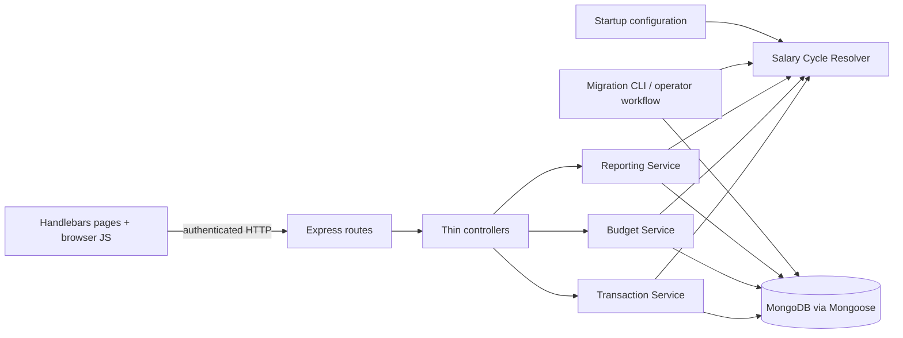
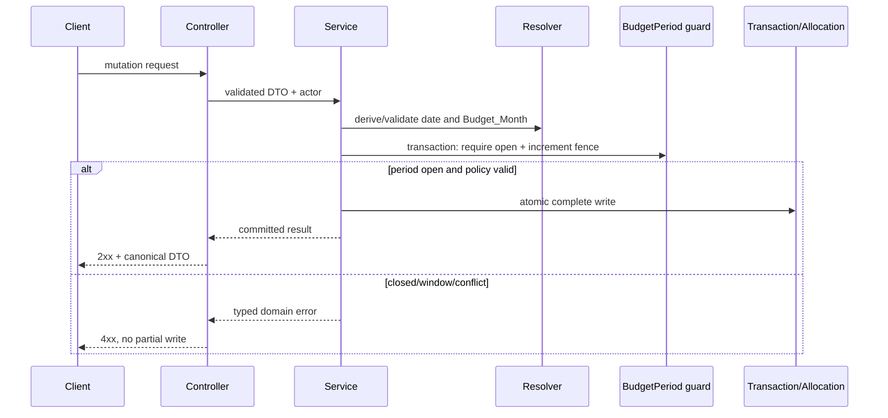
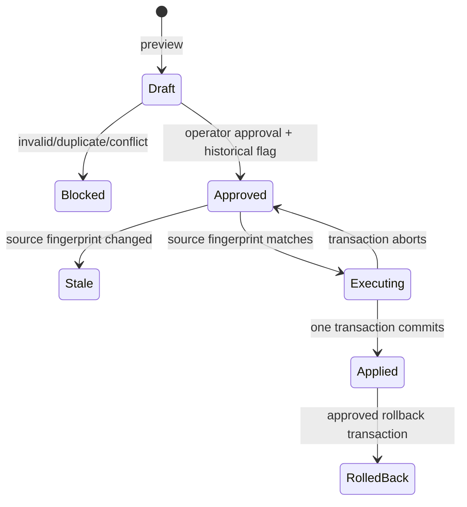

# Technical Design Document

## Overview

Salary-cycle budgeting changes the meaning of a named budget month without changing Money Journal's core web architecture. A `Budget_Month` remains a month/year identifier, but its period begins on the prior month's adjusted payday and ends one day before the named month's adjusted payday. The server, using the configured `Asia/Jakarta` household time zone, becomes the only authority for deriving transaction assignment.

This design is grounded in the current Node.js/Express, Mongoose, Handlebars, and browser-JavaScript application. It preserves the existing authenticated pages and API paths while moving date, budget, close-state, and reporting logic out of `controllers/budgetController.js` and `controllers/transactionController.js` into testable services. No application code is changed by this document.

### Goals

- Represent expense dates as calendar dates rather than accidental UTC instants.
- Apply the 25th/payday-Friday rule identically in transaction writes, budget editing, reports, and migrations.
- Support Monthly or Weekly cadence independently for each pocket and Budget_Month.
- Preserve inactive allocations, existing monthly budget identifiers, transaction history, and closed history.
- Enforce authorization, editable-window, closed-period, uniqueness, and no-partial-write guarantees on the server.
- Introduce the feature through an additive, previewed, reversible deployment.

### Non-goals

- Changing the configured pocket list or the three-pocket split limit.
- Adding allocation recurrence, carryover, or manual Budget_Month overrides.
- Reclassifying historical transactions without a separately approved immutable migration preview.
- Replacing Express, Handlebars, Mongoose, MongoDB, Chart.js, or the existing session model.

### Approved design decisions

| Decision | Design consequence |
|---|---|
| Household time zone is `Asia/Jakarta` | Startup validates `HOUSEHOLD_TIME_ZONE`; absence defaults to `Asia/Jakarta`. All date decisions use this value, never host or browser time zone. |
| Weekend payday moves backward to Friday | Saturday the 25th resolves to the 24th; Sunday the 25th resolves to the 23rd. |
| Payday starts the following Budget_Month | Comparison is inclusive: `expenseDate >= actualPayday` advances the month, including December to January rollover. |
| ISO Monday-Sunday weeks | Week identity is `YYYY-Www`, using ISO week-year rather than calendar year. |
| Cadence is per pocket and Budget_Month | A new cadence record has a unique `(pocket, month, year)` key. |
| Crossing weeks occur in both periods | Week options show full Monday/Sunday dates; attribution uses the intersection with the selected salary cycle. |
| Inactive allocations remain stored | Cadence chooses which allocation set participates in calculations; cadence changes never delete the other set. |
| Weekly allocations do not recur or carry | Missing exact week keys resolve to zero without writes; no prior week is consulted. |
| Historical reassignment requires approval | Preview and execution are separate operations, source-version checked, operator authorized, and all-or-nothing. |
| Concurrent allocation writes use accepted-write ordering | Atomic whole-document updates and unique indexes guarantee one record; the last database-accepted write is visible, with no mixed fields. Responses expose the resulting version for observability. |

### Current-code findings

- `models/transaction.js` stores `date` as BSON `Date` and requires client-provided `budgetMonth`/`budgetYear`; create trusts those fields, while update and delete omit closed-period checks.
- `models/pocketBudget.js` already provides the correct unique monthly key and must retain its collection and `_id` values. Weekly allocations therefore use a separate collection rather than overloading old monthly documents.
- `models/closedMonth.js` deletes a marker when reopening. That cannot serialize a close against a concurrent write to an open month, so it evolves into an always-present Budget Period guard in the same collection.
- `controllers/budgetController.js` computes spending correctly for basic split expenses but mixes parsing, authorization, persistence, aggregation, and response formatting. Its unused calendar `startDate`/`endDate` variables do not currently constrain attribution.
- `public/js/log-spending.js`, `monthly-story.js`, and `review-history.js` use `Date`, `toISOString()`, or device-local getters for date-only values. The new flow treats `YYYY-MM-DD` and `YYYY-MM` as opaque validated strings.
- `scripts/migrate-budget-month.js` hard-codes March 2026 and writes immediately. It is replaced by preview, approval, execution, verification, and rollback operations.
- `package.json` has no working tests. The design adds the built-in Node test runner plus `fast-check`, `supertest`, and a replica-set-capable MongoDB test fixture.

### Research findings informing the design

- `Temporal.PlainDate` models a calendar date independently of a time zone and exposes ISO day/week fields, which matches Expense_Date and week calculations better than legacy `Date` ([Temporal PlainDate documentation](https://tc39.es/proposal-temporal/docs/plaindate.html)). Temporal distinguishes wall-clock/calendar values from exact instants and uses IANA time-zone data ([Temporal time-zone documentation](https://tc39.es/proposal-temporal/docs/timezone.html)). Because this repository supports Node 18, the server uses `@js-temporal/polyfill` rather than assuming native Temporal.
- MongoDB guarantees atomicity for one document, while multiple-document invariants require transactions; Mongoose's transaction wrapper handles commit, abort, retry, and change tracking ([MongoDB atomicity](https://www.mongodb.com/docs/manual/core/write-operations-atomicity/), [Mongoose transactions](https://mongoosejs.com/docs/transactions.html)). This drives single-document allocation writes and transactions only where a period guard and another document must change together.
- A unique compound index enforces one document for each composite allocation key even under concurrent requests ([MongoDB unique indexes](https://www.mongodb.com/docs/manual/core/index-unique/)). Index creation must follow duplicate detection because MongoDB refuses a unique index when existing data violates it.
- MongoDB supports mixed schema versions during additive rollouts ([MongoDB schema versioning pattern](https://www.mongodb.com/docs/manual/data-modeling/design-patterns/data-versioning/schema-versioning/)). Canonical `expenseDate` is therefore added beside the legacy `date` field, and old monthly budget documents remain readable during rollback.
- `fast-check` supports configurable run counts and reproducible seeds ([fast-check configuration](https://fast-check.dev/docs/configuration/)). Each design property will run at least 100 generated cases and report its seed/path on failure.

Content was rephrased for compliance with licensing restrictions.

## Architecture

### Logical architecture



`SalaryCycleResolver` is a pure module. It accepts explicit inputs and returns serializable values; it never reads MongoDB, sessions, `new Date()` for date-only parsing, or process-local time. Services own business transactions. Controllers translate HTTP input/output only. This separation removes duplicated calendar logic from the current controllers and browser scripts.

### Write architecture and period guard

Every protected mutation executes through `withOpenBudgetPeriod(month, year, session, operation)`. The `closedmonths` collection evolves into an always-present Budget Period guard. Within one MongoDB transaction, the helper atomically matches `isClosed: false`, increments `mutationSequence`, then performs the transaction/allocation/cadence write. Closing or reopening updates the same guard document. A concurrent close and write therefore conflict on one guard; a retried write observes the closed state and fails without mutation.



For an Expense_Date update that crosses Budget_Months, the service acquires source and destination guards in sorted `YYYY-MM` order in the same transaction. Both must be open. Delete acquires the stored source guard. Notification email is queued only after a successful commit; email failure never rolls back the financial write.

### Read architecture

Budget and reporting reads filter by stored `budgetMonth`/`budgetYear`, then use canonical `expenseDate` and pocket shares for cadence-specific attribution. Stored assignment is authoritative; reports do not infer a different month at read time. Pure aggregation helpers receive records and period/week boundaries, which permits property testing without MongoDB.

### Deployment architecture

The feature is guarded by `SALARY_CYCLE_BUDGETING_ENABLED`. Compatibility readers understand schema versions 1 and 2 before any migration. New writes dual-write canonical `expenseDate` and the legacy `date` compatibility instant, but all salary-cycle decisions use only `expenseDate`. The compatibility instant represents local noon in `Asia/Jakarta`, never UTC midnight, and is not exposed as the canonical Expense_Date.

## Components and Interfaces

### 1. Startup configuration

A configuration module resolves:

```text
HOUSEHOLD_TIME_ZONE = environment value || "Asia/Jakarta"
SALARY_CYCLE_BUDGETING_ENABLED = false by default during rollout
```

Startup validates the time-zone identifier through Temporal before opening the HTTP listener. Invalid configuration throws `CONFIG_INVALID_TIME_ZONE` and terminates startup. Controllers receive the validated configuration by dependency injection; they do not read environment variables directly.

### 2. SalaryCycleResolver

Proposed module: `services/salaryCycleResolver.js`, using `@js-temporal/polyfill`.

```js
parseExpenseDate(value) -> PlainDate | ValidationError
parseBudgetMonth("YYYY-MM") -> { year, month, key } | ValidationError
parseIsoWeek("YYYY-Www") -> { weekYear, weekNumber, key } | ValidationError
getActualPayday({ year, month, timeZone }) -> "YYYY-MM-DD"
resolveBudgetMonth({ expenseDate, timeZone }) -> { key, month, year }
getSalaryCyclePeriod({ budgetMonth, timeZone }) -> { startDate, endDate }
getActiveBudgetMonth({ nowInstant, timeZone }) -> BudgetMonth
listIntersectingIsoWeeks({ period }) -> WeekDescriptor[]
intersectPeriodAndWeek({ period, week }) -> { startDate, endDate }
```

Algorithm details:

1. Strictly match date input against `^\d{4}-\d{2}-\d{2}$`; create `Temporal.PlainDate.from(value, { overflow: 'reject' })`; require round-trip `toString() === value`.
2. Create the nominal payday as `PlainDate(year, month, 25)`. Subtract one day for ISO `dayOfWeek === 6`, two for `dayOfWeek === 7`, otherwise zero.
3. Compare PlainDates. If Expense_Date is before that month's Actual_Payday, return its calendar month. Otherwise add one calendar month to `PlainYearMonth`, naturally handling December.
4. For a target Budget_Month, period start is the preceding calendar month's Actual_Payday; period end is the target month's Actual_Payday minus one day.
5. For weeks, subtract `dayOfWeek - 1` days to obtain Monday, add six for Sunday, and deduplicate by `yearOfWeek` plus `weekOfYear`. Return weeks in ascending Monday order.
6. Active Budget_Month uses an injected exact `nowInstant`, converted once to the household zoned date, then calls the same assignment function. Tests never depend on the host clock.

No function accepts a JavaScript `Date` for a date-only operation. No browser computes salary-cycle boundaries.

### 3. TransactionService

The existing `services/transactionService.js` retains category/role summary helpers and gains commands, or commands move to a dedicated `transactionWriteService.js` to keep files focused:

```js
createExpense(command, actor)
updateExpense(id, command, actor)
deleteExpense(id, actor)
getExpense(id, actor)
listExpenses(filters, actor)
```

Command processing order is: shape validation; strict Expense_Date parsing; source/split validation; Budget_Month derivation; optional client month consistency check; source/destination period checks; atomic write. Missing client `budgetMonth`/`budgetYear` is accepted. Matching values are accepted. Any mismatch returns HTTP 409 with `derivedBudgetMonth` and performs no write.

The source processor no longer silently converts an invalid multi-pocket request to single-pocket mode. It validates amount as finite and positive, validates 1-3 unique pockets, and requires the exact numeric sum of shares after normalization to integer rupiah. `paidBy` and actor role never participate in assignment.

API DTOs expose `expenseDate: "YYYY-MM-DD"` and retain `date: "YYYY-MM-DD"` as a compatibility alias. Internally, `expenseDate` is authoritative. Editing returns the exact saved string.

### 4. BudgetService

Proposed module: `services/budgetService.js`.

```js
getBudgetMonthView({ budgetMonth, selectedWeek }, actor)
getBudgetHistory(actor)
setCadence({ pocket, budgetMonth, cadence, confirmInactive }, actor)
putMonthlyAllocation({ pocket, budgetMonth, amount }, actor)
putWeeklyAllocation({ pocket, budgetMonth, isoWeek, amount }, actor)
deleteAllocation({ allocationType, id }, actor)
toggleBudgetMonthClosed({ budgetMonth }, actor)
getClosedBudgetMonths(actor)
```

Rules applied to every cadence/allocation mutation:

1. Actor must have `Wife` role.
2. Pocket, key, cadence, and finite non-negative amount are validated before persistence.
3. Requested month must be the active Budget_Month or its immediate successor, calculated in `Asia/Jakarta` from an injected current instant.
4. The Budget Period guard must be open inside the same transaction as the write.
5. A weekly key must be a real ISO week and intersect the salary-cycle period.
6. Cadence switches with saved now-inactive allocations require `confirmInactive: true`; both UI and service enforce the confirmation. No allocation is removed.

Monthly allocation writes continue using `PocketBudget.findOneAndUpdate({ pocket, month, year }, complete $set, { upsert: true })`. Weekly writes use the equivalent exact compound key. The unique indexes are the final arbiter under racing creates. A duplicate-key result from simultaneous upserts is retried as an update. Each accepted write sets amount, updater, and timestamps together and increments `version`; therefore metadata cannot be assembled from different requests. Accepted writes use database commit order, with the last accepted complete record becoming visible.

`getBudgetMonthView` returns:

```json
{
  "budgetMonth": "2027-02",
  "timeZone": "Asia/Jakarta",
  "period": { "startDate": "2027-01-25", "endDate": "2027-02-24" },
  "isClosed": false,
  "canEdit": true,
  "availableWeeks": [{
    "key": "2027-W04",
    "weekYear": 2027,
    "weekNumber": 4,
    "startDate": "2027-01-25",
    "endDate": "2027-01-31",
    "intersectionStartDate": "2027-01-25",
    "intersectionEndDate": "2027-01-31"
  }],
  "pockets": [],
  "aggregate": {
    "allocation": 0,
    "spending": 0,
    "remaining": 0,
    "percentageUsed": 0,
    "status": "good"
  }
}
```

Each monthly pocket contains its monthly allocation (or missing marker) and full-period metrics. Each weekly pocket contains all week descriptors, the selected week and exact allocation (or missing marker), selected-intersection metrics, and full-period aggregate metrics. The Budget_Month aggregate uses the monthly amount for Monthly pockets and the sum of all intersecting exact weekly allocations for Weekly pockets; spending is summed once across the whole period.

### 5. Spending attribution and status policy

Proposed pure helpers in `services/budgetCalculationService.js`:

```js
expandEligibleSpendingItems(transactions) -> PocketShare[]
calculatePocketPeriod(items, allocation) -> metrics
calculatePocketWeek(items, allocation, intersection) -> metrics
calculateBudgetAggregate(pocketMetrics) -> metrics
```

A single-pocket transaction expands to one item of its full amount. A multi-pocket transaction expands only to its saved shares; the top-level amount is not additionally counted. Eligibility requires matching stored Budget_Month and pocket. Weekly eligibility additionally requires `expenseDate` within the inclusive week/cycle intersection. ISO strings may be compared lexicographically only after strict validation because they are fixed-width calendar dates.

`remaining = allocation - spending`. Missing allocation behaves as amount zero and does not create a document. Percentage is `Math.round(spending / allocation * 100)` for positive allocation and zero otherwise. Check Pockets pocket status uses `<70 good`, `70-89 warning`, `>=90 danger`; aggregate status uses `<70 good`, `70-99 warning`, `>=100 danger`. Monthly Story alerts use `<80 none`, `80-99 warning`, `>=100 danger` for both monthly and selected weekly metrics.

### 6. ReportingService

Proposed module: `services/reportingService.js` supplies the current dashboard and history controllers. It filters all totals, categories, roles, comparisons, recent items, alerts, and history lists by stored assignment. Previous-month comparison means the immediately preceding named Budget_Month, not a raw calendar date range. Returned dates come from `expenseDate` without replacement by the salary-cycle start date.

`getDashboardSummary` joins active cadence and allocation data through BudgetService rather than querying every `PocketBudget` as monthly. `getAllTransactions` continues accepting `month=YYYY-MM`, validates it strictly, and filters the stored numeric month/year fields. Pocket filtering matches either the single pocket or a multi-pocket share, while displayed transaction totals still count each transaction once.

### 7. Controllers and routes

Existing authenticated routes remain available. Controllers use a common async error adapter and typed domain errors.

| Method and route | Design |
|---|---|
| `GET /api/salary-cycle/assignment?date=YYYY-MM-DD` | New authenticated endpoint for Log Spending preview; returns derived Budget_Month and period. |
| `GET /api/budget?month=YYYY-MM&week=YYYY-Www` | Extends current response with period, cadence, weeks, active allocations, metrics, and aggregate. `month` defaults to server-derived active month; `week` is optional. |
| `POST /api/budget` | Compatibility adapter for the old monthly payload; writes Monthly allocation and does not change cadence unless no cadence exists, in which case effective default is Monthly. |
| `PUT /api/budget/cadence` | New Wife-only cadence command with confirmation flag. |
| `PUT /api/budget/allocation/monthly` | New explicit monthly upsert. |
| `PUT /api/budget/allocation/weekly` | New exact-week upsert. |
| `DELETE /api/budget/:id` | Retained for monthly allocation compatibility; now enforces role, window, and closed guard. |
| `DELETE /api/budget/allocation/:type/:id` | New typed allocation delete. |
| `POST /api/budget/toggle-month-close` | Retained; updates the guard rather than creating/deleting an uncoordinated marker. |
| Existing transaction routes | Retained; create/update derive assignment and delete/update enforce source/destination guards. |
| Existing dashboard/history routes | Retained; responses gain canonical period/date fields without removing current totals. |

Authentication remains route middleware. Authorization is repeated in services so a future controller cannot bypass it. Unauthenticated API requests return 401 without data; page requests retain the login redirect.

### 8. Browser UI flow

#### Log Spending

- The native date input continues producing `YYYY-MM-DD`; JavaScript does not call `new Date(value)` or `toISOString()` for it.
- On initial load and each date change, the page calls the assignment preview endpoint. Budget Month renders as a read-only label with salary-cycle range; the current editable pills/select are removed.
- An invalid date displays the server field error next to Date and disables submit.
- Submit may omit budget fields. During compatibility rollout it may echo derived month/year; a mismatch receives 409 and refreshes the preview rather than offering override.
- Edit loads `expenseDate` directly into the date input. If the edit would cross into or out of a closed period, the server rejects the whole update and the form keeps its entered values for correction.

#### Check Pockets

- Initial month comes from `GET /api/budget` without a browser-computed default. Header shows named Budget_Month plus inclusive salary-cycle range.
- Each pocket card shows cadence. Monthly cards show period allocation/spend/remaining/percentage. Weekly cards show one ISO week selector, full Monday/Sunday labels, intersection context, and exact weekly metrics.
- Wife users can switch cadence. If the response indicates saved allocations would become inactive, a confirmation dialog names them; cancel sends no request. Confirm sends `confirmInactive: true`.
- Missing weeks display zero allocation without creating data. Save affects only the selected exact key. The UI contains no repeat or carryover controls.
- Closed and out-of-window months remain navigable but all mutation controls are disabled based on server `canEdit`; the server remains authoritative.

#### Monthly Story and Review History

- Month defaults come from server active Budget_Month metadata, not `new Date().toISOString().slice(0, 7)`.
- Both pages display the salary-cycle range. Transaction grouping uses the saved date string, constructing a display date only with explicit local components or Temporal.
- Alerts distinguish weekly pocket/week from monthly pocket/period. Charts and totals remain named-Budget_Month aggregates.

### 9. MigrationProcess

The immediate-write `scripts/migrate-budget-month.js` is retired. A replacement operator-only CLI supports `preview`, `approve`, `execute`, `verify`, and `rollback`; it never starts an HTTP server. Migration code uses the same resolver and validators as runtime code.



Preview scans monthly budgets, transactions, and closed markers and records immutable per-record before/after values. It proposes:

- `BudgetCadence: Monthly` for existing monthly budgets, while retaining each `PocketBudget` `_id`, `budget`, pocket, month/year, creator, and timestamps.
- Canonical `expenseDate` and schema version for existing transactions. Existing `date` remains for compatibility.
- Derived transaction assignment differences, but marks them `requiresHistoricalApproval`. Without explicit approval these differences are reported and excluded from the executable change set.
- `isClosed: true`, closing metadata, and mutation fence fields for existing closed documents, preserving `_id`, user, and timestamps; open guards are created for referenced months.

A preview header stores counts, configuration, code/schema version, source fingerprint, status, creator, and timestamps. Separate preview-item documents avoid MongoDB's document-size limit and store collection, record id, change type, exact Extended JSON before/after values, and blocking reason. The fingerprint hashes sorted `{collection,id,updatedAt-or-contentHash}` entries plus time zone and migration version.

Execution requires Wife/operator authorization, immutable preview status `Approved`, an explicit `historicalReassignmentApproved` flag if any assignments change, matching current fingerprint, no blockers, and a replica-set/sharded MongoDB deployment that supports transactions. All approved changes and preview status update commit in one `mongoose.connection.transaction()` with majority write concern; operations run sequentially inside the transaction. A preflight size/time estimate rejects an oversized preview as an unresolvable conflict rather than risk partial batches. Any error aborts every write, leaving recorded before-values intact.

Verification compares every applied record to its preview after-value, checks indexes and invariants, and reports route-level access checks. Rerun generates zero transformations because every transform is idempotent. Rollback is a separately approved transaction applying the same preview items in reverse after verifying no affected record changed since execution. An external database backup remains mandatory before production execution and is the fallback if rollback preconditions fail.

### 10. Backward compatibility

- Existing page and API routes remain authenticated and available.
- Legacy transaction clients may omit budget fields; old fields that match derivation are accepted, and conflicts receive an actionable 409 rather than silent reassignment.
- Response `date` remains as a `YYYY-MM-DD` alias while `expenseDate` is introduced. Existing BSON `date` values remain stored during the compatibility window.
- The existing `pocketbudgets` collection and monthly `budget` field remain intact, so old code can still read monthly allocations during emergency rollback. Weekly allocations and cadence are additive collections ignored by old code.
- Missing cadence on a pre-migration record has an effective read default of Monthly. Writes backfill an explicit cadence.
- Feature-disabled code uses compatibility readers but does not expose weekly mutations. Once migration verifies, the feature flag enables the new UI and authoritative derivation together.

## Data Models

All named Budget_Months retain numeric `month` and `year` for compatibility and expose computed `YYYY-MM` keys in DTOs. Amounts are integer rupiah; services reject non-finite, fractional, or negative allocation values and non-positive expense/share values.

### Transaction (`transactions`, evolved)

| Field | Type | Notes |
|---|---|---|
| Existing identity/category/pocket/note/user/payer/amount/source fields | existing | Preserved. Split shares remain `sourceBreakdowns` for database compatibility and are exposed as Pocket Shares. |
| `expenseDate` | String | Required for schema v2; strict `YYYY-MM-DD`; canonical Expense_Date. |
| `date` | Date, optional compatibility field | Existing value preserved. New writes may dual-write local-noon compatibility instant; never used for classification or returned as canonical date. |
| `budgetMonth`, `budgetYear` | Number | Required stored authoritative assignment. |
| `assignmentVersion` | String | `salary-cycle-v1` for derived assignments; `legacy-preserved` while an old assignment awaits approved reclassification. |
| `schemaVersion` | Number | `2` after canonical date migration/new writes. |
| timestamps | Date | Enable Mongoose timestamps while preserving current values. |

Indexes:

- `{ budgetYear: 1, budgetMonth: 1, expenseDate: -1 }` for report/history reads.
- `{ budgetYear: 1, budgetMonth: 1, pocket: 1 }` for single-pocket candidates.
- `{ budgetYear: 1, budgetMonth: 1, "sourceBreakdowns.pocket": 1, expenseDate: 1 }` for split attribution.

Service validation preserves `sum(sourceBreakdowns.amount) === amount`; a multi transaction has 1-3 unique valid pockets.

### PocketBudget / MonthlyAllocation (`pocketbudgets`, evolved in place)

| Field | Type | Notes |
|---|---|---|
| `_id`, `pocket`, `month`, `year`, `budget`, `createdBy`, timestamps | existing | Retained exactly through migration. `budget` is the Monthly_Allocation amount. |
| `updatedBy` | ObjectId | Actor for latest accepted write. |
| `version` | Number | Incremented on each accepted write for diagnostics. |
| `schemaVersion` | Number | `2` after migration/new writes. |

Unique index remains `{ pocket: 1, month: 1, year: 1 }`. The collection is not used for weekly documents, preventing key ambiguity and preserving rollback compatibility.

### PocketBudgetCadence (`pocketbudgetcadences`, new)

| Field | Type | Rules |
|---|---|---|
| `pocket` | enum String | Existing `POCKETS` key. |
| `month`, `year` | Number | Named Budget_Month. |
| `cadence` | enum String | `Monthly` or `Weekly`. |
| `createdBy`, `updatedBy` | ObjectId | Audit actors. |
| `version` | Number | Increment per accepted cadence update. |
| timestamps | Date | Audit timestamps. |

Unique index: `{ pocket: 1, month: 1, year: 1 }`.

### WeeklyAllocation (`weeklyallocations`, new)

| Field | Type | Rules |
|---|---|---|
| `pocket` | enum String | Existing pocket. |
| `month`, `year` | Number | Named Budget_Month, not ISO week-year. |
| `isoWeekYear` | Number | ISO week-year from validated week descriptor. |
| `isoWeekNumber` | Number | Valid existing week 1-52/53. |
| `budget` | Number | Integer rupiah, finite and `>= 0`. |
| `createdBy`, `updatedBy` | ObjectId | Audit actors. |
| `version` | Number | Increment per accepted complete write. |
| timestamps | Date | Audit timestamps. |

Unique index: `{ pocket: 1, month: 1, year: 1, isoWeekYear: 1, isoWeekNumber: 1 }`. Read index: `{ year: 1, month: 1, pocket: 1 }`.

### BudgetPeriod (`closedmonths`, evolved in place)

| Field | Type | Rules |
|---|---|---|
| `_id`, `month`, `year`, `closedBy`, timestamps | existing/evolved | Existing closed record identity and audit values preserved. |
| `isClosed` | Boolean | Always present in schema v2; reopen sets false rather than deleting. |
| `closedAt` | Date/null | Set on close, cleared on reopen. |
| `updatedBy` | ObjectId | Latest state-changing actor. |
| `mutationSequence` | Number | Incremented by every protected mutation to serialize against close/reopen. |
| `schemaVersion` | Number | `2`. |

Unique index remains `{ month: 1, year: 1 }`. All referenced and editable periods have a guard document.

### MigrationPreview (`migrationpreviews`, new)

Fields: `_id`, `migrationVersion`, `timeZone`, `status` (`Draft`, `Blocked`, `Approved`, `Executing`, `Applied`, `Stale`, `RolledBack`), `historicalReassignmentApproved`, `sourceFingerprint`, counts by change type, scanned/unchanged/invalid/duplicate/conflict totals, creator/approver/executor, applied fingerprint, and timestamps. Status transitions use conditional atomic updates.

### MigrationPreviewItem (`migrationpreviewitems`, new)

Fields: `previewId`, `sequence`, `collectionName`, `recordId`, `changeType`, exact Extended JSON `before`, exact Extended JSON `after`, `executable`, `blockingReason`, and `sourceRecordFingerprint`. Unique index `{ previewId: 1, collectionName: 1, recordId: 1, changeType: 1 }`; execution index `{ previewId: 1, executable: 1, sequence: 1 }`.

## Correctness Properties

*A property is a characteristic or behavior that should hold true across all valid executions of a system—essentially, a formal statement about what the system should do. Properties serve as the bridge between human-readable specifications and machine-verifiable correctness guarantees.*

The properties below are the non-redundant result of acceptance-criteria testing prework and property reflection. Each property maps to one executable `fast-check` test. Pure date and calculation properties run in memory; the concurrency property runs against an isolated replica-set-capable MongoDB fixture so the test exercises the same unique indexes and transaction semantics as production. Every property test runs at least 100 generated cases and records the `fast-check` seed and shrink path on failure.

### Property 1: Payday weekend adjustment

For any valid month and year in the supported calendar range, Actual_Payday is the 25th when Nominal_Payday is Monday through Friday, the 24th when Nominal_Payday is Saturday, and the 23rd when Nominal_Payday is Sunday; every adjusted weekend payday is a Friday in Household_Time_Zone.

**Validates: Requirements 1.1, 1.2, 1.3, 1.4**

**Executable test:** Generate valid `{ year, month }` pairs, derive the independent expected date from the nominal day-of-week table, and compare it with `getActualPayday`. The generator must include leap years, every month, and years where the 25th falls on each weekday.

### Property 2: Salary-cycle periods form a contiguous partition

For any valid pair of chronologically adjacent Budget_Months, the later Salary_Cycle_Period starts exactly one local calendar day after the earlier period ends, the periods do not overlap, and every generated local date around their shared boundary belongs to exactly one of the two periods.

**Validates: Requirements 2.4, 2.5, 2.6, 2.7**

**Executable test:** Generate a Budget_Month and its successor, call `getSalaryCyclePeriod` for both, and use `Temporal.PlainDate` arithmetic in the test oracle to check adjacency, non-overlap, and unique membership for generated dates spanning both periods.

### Property 3: Payday is the inclusive assignment boundary

For any valid calendar month and any valid Expense_Date in that month, dates before Actual_Payday resolve to that calendar month, while Actual_Payday and all later dates resolve to the immediately following Budget_Month.

**Validates: Requirements 2.1, 2.2, 9.1, 9.2**

**Executable test:** Generate a year/month and a valid day from that month, compare the date to independently calculated Actual_Payday, and assert `resolveBudgetMonth` and `getActiveBudgetMonth` return the expected side of the inclusive boundary. `getActiveBudgetMonth` receives a generated exact instant whose Jakarta local date is the generated day.

### Property 4: December assignment rolls into the following year

For any valid year, every Expense_Date from December Actual_Payday through December 31 resolves to January of the following year, and that January Salary_Cycle_Period begins on the same December Actual_Payday.

**Validates: Requirements 2.3, 2.4, 9.3**

**Executable test:** Generate supported years and valid December dates at or after Actual_Payday, then assert both assignment and January period-start results, including years in which December 25 falls on Saturday or Sunday.

### Property 5: Assignment is deterministic and metadata-independent

For any valid Expense_Date and Household_Time_Zone, repeated resolution produces the same Budget_Month, and changing payer, authenticated household role, category, note, amount, or pocket data without changing Expense_Date or Household_Time_Zone does not change that assignment.

**Validates: Requirements 1.5, 2.5, 3.10**

**Executable test:** Generate one date/zone plus two arbitrary valid non-date transaction DTOs, invoke the resolver repeatedly and the transaction assignment mapper for both DTOs, and assert all resulting Budget_Month keys are identical.

### Property 6: Date-only assignment and round trips are time-zone independent

For any valid `YYYY-MM-DD` Expense_Date and configured Household_Time_Zone, varying simulated client offsets and server host time zones does not change the derived Budget_Month, Salary_Cycle_Period, ISO Calendar_Week identity, or saved/editable date string; storage and DTO round trips preserve the exact calendar year, month, and day.

**Validates: Requirements 11.1, 11.3, 11.4, 11.5, 11.6, 11.10**

**Executable test:** Generate strict valid date strings, Budget_Months, supported IANA zones, and contrasting host/client offsets. Exercise pure parsing/formatting under injected zone contexts (and a small subprocess matrix with different `TZ` values for host-independence), then assert canonical outputs and the returned edit value are equal. The oracle never parses the generated date through legacy `Date` or UTC midnight.

### Property 7: ISO weeks partition each salary-cycle period

For any valid Budget_Month, `listIntersectingIsoWeeks` returns exactly the distinct ISO Monday-through-Sunday weeks that intersect its Salary_Cycle_Period, ordered by Monday, and every local date in the period belongs to exactly one returned week.

**Validates: Requirements 5.2**

**Executable test:** Generate Budget_Months across ordinary, leap-year, ISO week-year, and calendar-year boundaries. Enumerate each period date with `Temporal.PlainDate`, derive its independent ISO week key, and compare the ordered distinct key set and full Monday/Sunday boundaries with the resolver output.

### Property 8: Crossing-week attribution uses the period intersection

For any ISO Calendar_Week that intersects an Actual_Payday boundary, the week appears in both adjacent Budget_Month week lists, and any generated Eligible_Spending_Item is included only in the adjacent period containing its Expense_Date; an item before payday is excluded from the following period and an item on or after payday is excluded from the earlier period.

**Validates: Requirements 5.4, 6.2**

**Executable test:** Generate payday-crossing weeks, dates on both sides of payday, pockets, and positive integer amounts. Compare `intersectPeriodAndWeek` and weekly spending output with an independent inclusive range-intersection/filter oracle.

### Property 9: Pocket-share expansion conserves spending exactly once

For any generated valid collection of single-pocket and split expenses, expanding and aggregating Eligible_Spending_Items attributes each single-pocket amount once, attributes each split Pocket_Share once without also counting its parent amount, preserves each split invariant `sum(Pocket_Shares) = expense.amount`, and preserves total eligible spending across pockets.

**Validates: Requirements 6.1, 6.3, 6.4, 6.5, 6.6, 6.11, 6.12, 7.8**

**Executable test:** Generate positive integer expense totals and valid one-to-three-pocket partitions, including mixed Monthly and Weekly cadence pockets. Compare `expandEligibleSpendingItems` and aggregate results with a simple reference multiset of expected pocket shares; compare multisets as well as totals so duplicate-and-omission defects cannot cancel each other.

### Property 10: Cadence and allocation updates are isolated by key

For any valid allocation state and target Pocket/Budget_Month key, changing cadence or one Monthly_Allocation/Weekly_Allocation changes only the targeted cadence or exact allocation key, preserves all inactive allocations, excludes inactive-cadence amounts from calculations, and leaves every other pocket, month, and week unchanged.

**Validates: Requirements 4.3, 4.4, 4.5, 4.6, 4.7, 4.12, 5.7**

**Executable test:** Generate normalized maps containing cadence, monthly allocations, and multiple exact weekly keys. Apply one generated command to the pure state transition/reference calculation layer, assert deep equality for every non-target key, and assert active aggregates use only the post-command active cadence while both allocation sets remain stored.

### Property 11: Remaining balance and percentage arithmetic are consistent

For any non-negative integer allocation and attributed-spending total, remaining equals `allocation - spending`; equal values produce zero, overspending produces the negative arithmetic difference, and percentage used is the nearest integer to `spending / allocation * 100` for a positive allocation and zero for zero or missing allocation without altering spending or remaining.

**Validates: Requirements 6.7, 6.8, 6.9, 6.10, 7.13, 7.14, 7.15**

**Executable test:** Generate safe-range integer rupiah values, plus a missing-allocation variant, and compare `calculatePocketPeriod`, `calculatePocketWeek`, and `calculateBudgetAggregate` with the direct arithmetic oracle. Generators explicitly cover zero, equality, one-rupiah under/over, and large safe integers.

### Property 12: Migration transformation is preserving and idempotent

For any valid generated legacy dataset, applying the salary-cycle migration transformation twice yields data equivalent to applying it once, the second preview contains zero additional transformations, and all identifiers, financial values, ownership fields, Expense_Date values, split shares, close metadata, and original timestamps required for preservation remain unchanged.

**Validates: Requirements 10.1, 10.2, 10.8, 10.9, 10.14**

**Executable test:** Generate normalized legacy budgets, transactions, and closed-month records, run the pure preview/transform function once and again over its result, and assert deep canonical equality plus an empty second change set. The generator includes already-migrated records and mixed schema versions to verify additive rollout behavior.

### Property 13: Concurrent allocation writes preserve uniqueness and complete accepted values

For any generated set of two or more valid concurrent writes targeting one Allocation_Composite_Key, after all accepted/rejected operations settle, at most one allocation record exists for that key, the visible amount and correlated metadata equal one complete accepted request, and no field from a rejected or different request is mixed into the final record. Under accepted-write ordering, the final record equals the last database-accepted complete write and remains so until another write is accepted.

**Validates: Requirements 5.8, 12.9, 12.10, 12.11, 12.12, 12.13, 12.14**

**Executable test:** Generate request tuples with a unique correlation token encoded in `{ amount, updatedBy, requestToken }`, randomize launch delays, and execute `Promise.allSettled` writes against an isolated replica-set fixture with production unique indexes enabled. Query by the composite key, assert count is zero or one as appropriate, and require every final correlated field to match one accepted tuple. Retry-class duplicate-key paths and explicit conflict-rejection paths are both exercised; each generated case resets its collection and guard state.

## Error Handling

Controllers translate typed domain errors into stable API responses and never expose stack traces, MongoDB messages, collection names, indexes, session contents, or household data. Every error response uses a common envelope:

```json
{
  "error": {
    "code": "BUDGET_MONTH_CLOSED",
    "message": "The selected Budget Month is closed.",
    "field": "budgetMonth",
    "details": { "budgetMonth": "2027-02" },
    "requestId": "<opaque-id>"
  }
}
```

`field` and `details` are omitted when not applicable. Messages are safe for display; logs attach the original error, actor identifier when authenticated, request identifier, command type, and affected Budget_Month but never credentials or full financial payloads.

| Typed error | HTTP status | Stable code and handling | Requirements |
|---|---:|---|---|
| `DomainValidationError` | 400 | `VALIDATION_ERROR`; identifies the invalid field and reason for malformed/nonexistent dates, month/week identifiers, pockets, cadence, amounts, splits, and record identifiers. Validation completes before opening a transaction or issuing a write. | 1.6, 2.8, 3.8-3.9, 4.2, 4.8-4.9, 5.9-5.10, 11.8-11.9, 12.6-12.8 |
| `AuthenticationError` | 401 | `AUTHENTICATION_REQUIRED`; API requests disclose no household data and perform no mutation. Existing page behavior may redirect to login without embedding protected data. | 8.11, 12.16 |
| `AuthorizationError` | 403 | `WIFE_ROLE_REQUIRED` or `OPERATOR_ROLE_REQUIRED`; service authorization runs even when route middleware has already checked the session. | 8.9, 10.7 |
| `ClosedBudgetPeriodError` | 409 | `BUDGET_MONTH_CLOSED`; identifies the source, destination, or target named Budget_Month. Cross-period transaction edits report both keys when useful. | 8.1-8.8, 9.8 |
| `EditableWindowError` | 409 | `BUDGET_MONTH_NOT_EDITABLE`; returns the requested month and server-derived active/editable months. Reopening does not bypass this policy. | 8.8, 9.6-9.9 |
| `AssignmentConflictError` | 409 | `BUDGET_MONTH_ASSIGNMENT_CONFLICT`; returns only the server-derived month/year needed to correct a legacy request. | 3.5 |
| `ConcurrentWriteConflictError` | 409 | `ALLOCATION_WRITE_CONFLICT`; used only when the selected policy rejects a valid competing write. A rejected request does not alter amount, actor, timestamp, or version. Retriable duplicate-key races internal to accepted-write ordering are retried before this error is exposed. | 5.8, 12.12-12.14 |
| `MigrationConflictError` | 409 | `MIGRATION_PREVIEW_BLOCKED`, `MIGRATION_PREVIEW_STALE`, `MIGRATION_APPROVAL_REQUIRED`, or `MIGRATION_ROLLBACK_CONFLICT`; execution never starts or aborts completely. | 10.3-10.14 |
| `RecordNotFoundError` | 404 | `TRANSACTION_NOT_FOUND` or `ALLOCATION_NOT_FOUND`; authorization and identifier-shape checks occur first, and the response reveals no unrelated record data. | 12.8 |
| `StorageError` | 503 | `STORAGE_UNAVAILABLE` for exhausted transient retries, transaction/session failure, or unavailable database; duplicate-key errors are translated to a domain conflict rather than leaked. Unexpected invariant/index violations use `DATA_INTEGRITY_ERROR`, are logged at error level, and trigger operator review. | 3.1-3.2, 8.2-8.7, 10.13, 12.9-12.14 |
| `ConfigurationError` | startup failure | `CONFIG_INVALID_TIME_ZONE`, `CONFIG_TRANSACTIONS_REQUIRED`, or `CONFIG_INDEX_PRECONDITION_FAILED`; the process does not open the listener or execute migration writes. | 10.10, 11.7 |

### Atomicity and no-partial-write guarantees

- Transaction create stores canonical Expense_Date, derived Budget_Month, split data, and compatibility fields in one insert. Transaction update changes the complete validated record in one MongoDB transaction; a cross-period date edit acquires both Budget Period guards in sorted order. Any resolver, closed-period, authorization, conflict, or storage error aborts the operation and leaves the record unchanged.
- Transaction delete acquires the stored source period guard in the same database transaction as deletion. A close racing with create, update, or delete conflicts on the guard; after retry, exactly one complete outcome is visible.
- Cadence and allocation commands validate role, edit window, amount/key, and confirmation before persistence, then mutate the period guard and targeted record in one transaction. Atomic whole-document updates set amount and correlated audit metadata together. Unique indexes remain the final defense against duplicate composite keys.
- Close and reopen update the persistent Budget Period guard rather than deleting it. No cadence, allocation, or expense document is rewritten merely to mark a period closed. A failed close/reopen leaves both guard state and protected data at their before-values.
- Migration preview is read-only. Approved execution and rollback compare source fingerprints before writing and apply all preview items plus status transition in one database transaction. Injected or real failure before commit restores every affected record to its recorded before-value; email/notification work is queued only after commit and cannot change the financial outcome.
- Unknown exceptions are passed to the common error adapter, logged with `requestId`, and returned as generic `INTERNAL_ERROR` (500). The adapter must not convert an uncertain commit result into an automatic business retry unless the command is demonstrably idempotent and the database driver classifies the transaction as safely retryable.

## Testing Strategy

The project uses a layered Node.js test stack: the built-in `node:test` runner and `node:assert/strict` for orchestration/assertions, `fast-check` for generated properties, `supertest` for Express routes, a replica-set-capable isolated MongoDB fixture for Mongoose transactions and concurrency, and `jsdom` plus compiled Handlebars fixtures for browser interaction tests. Tests inject the clock, Household_Time_Zone, database connection, mail/notification queue, and feature flags; they never depend on host local time, production MongoDB, or live external services.

### Unit tests

- Test `SalaryCycleResolver` with focused examples for weekday, Saturday, Sunday, leap-day-adjacent periods, December/January rollover, ISO week 52/53, strict invalid date/month/week syntax, and invalid IANA zones.
- Test budget calculation helpers with concrete empty, exact-limit, one-rupiah overspend, missing allocation, mixed cadence, and payday-crossing examples. Boundary tests cover alert/status transitions at 69/70, 79/80, 89/90, 99/100 and zero denominators.
- Test command validators and typed-error mapping for every invalid field family, including `NaN`, infinities, fractions, duplicate pockets, share-sum mismatches, and malformed identifiers.
- Test migration preview hashing, canonical ordering, protected-field preservation, change classification, and pure transformation on compact fixtures.
- Keep example tests targeted: property tests cover broad input spaces, while unit examples document business boundaries and error messages.

### Property-based tests

- Implement Properties 1-13 with `fast-check`; do not build a custom generator framework. Each design property has exactly one corresponding top-level `fc.assert(fc.property(...)` or `fc.asyncProperty(...)` test.
- Configure at least `numRuns: 100` for every property, including asynchronous concurrency tests. CI may use a higher scheduled-run profile. Failure output must retain seed, path, and counterexample so the case can be replayed locally.
- Put generators for strict PlainDates, valid Budget_Months, real ISO weeks, safe integer rupiah, unique pocket partitions, mixed cadence states, legacy schema versions, and correlated concurrent-write requests in shared test helpers. Invalid-data arbitraries remain separate so successful-domain properties do not discard excessive cases.
- Every property test includes a source comment in this exact form: `Feature: salary-cycle-budgeting, Property N: <property title>`. The comment and test name also cite the requirement clauses from this document.
- Use a simple independently written oracle, not the production helper under another name. Date oracles use Temporal calendar arithmetic; aggregation oracles use straightforward filter/map/reduce and multiset comparison.

### Service and database integration tests

- Run TransactionService and BudgetService against isolated MongoDB with production Mongoose schemas, indexes, sessions, and transaction options. Cover create/update/delete, same-period and cross-period edits, guard acquisition order, role checks, editable windows, close/reopen, missing allocations, cadence confirmation, and exact weekly-key retrieval.
- Snapshot relevant collection records before rejected commands and compare after rejection to prove no partial mutation. For successful commands, verify canonical and compatibility fields plus audit metadata/version in the same assertion.
- Seed transactions whose calendar date and stored Budget_Month intentionally differ to verify ReportingService consistently treats stored assignment as authoritative.
- Inject transient transaction errors, duplicate-key races, unknown storage failures, and post-commit notification failures. Verify only classified safe retries occur and notifications never determine commit success.
- Run index preflight tests with duplicate fixtures, verify deployment blocks index creation, then verify the unique compound indexes after clean migration.

### Route and UI tests

- Use `supertest` with authenticated Wife, authenticated non-Wife household member, and unauthenticated agents. Exercise existing and new routes, status codes, stable error envelopes, no-data disclosure, compatibility payloads, and derived-assignment conflicts.
- Compile the relevant Handlebars views and execute browser modules in `jsdom`. Verify Expense_Date preview/read-only behavior, invalid-date submit blocking, salary-cycle labels, one-week selection, crossing-week labels, cadence confirmation/cancel behavior, and disabled closed/out-of-window controls.
- Mock only HTTP boundaries in UI tests; server-derived month/period values must be fixture responses rather than recomputed in browser test code. Add regression assertions that date-only flows do not call `toISOString()` or parse `YYYY-MM-DD` through UTC midnight.
- Use a small set of visual/snapshot assertions for required labels and control states; calculation correctness belongs to unit/property tests, not DOM snapshots.

### Migration tests

- For `preview`, prove zero writes by comparing collection counts, document fingerprints, and previewed exact before/after values around a mixed legacy fixture.
- Test blockers for invalid Expense_Date, invalid pocket, duplicate allocation key, unsupported transaction deployment, and unresolvable conflict; each reports every affected identifier and leaves source collections unchanged.
- Test approval and historical-reassignment gates, stale fingerprints, exact execution, verification, rerun with zero transformations, and separately approved rollback.
- Inject a deterministic failure after multiple preview items have been attempted and assert all source records and preview status return to their before-values. Also test rollback refusal when a post-migration record has changed.
- After successful migration, run authenticated smoke tests for Check Pockets, Log Spending, Monthly Story, Review History, budget APIs, and transaction APIs over converted records.

### Concurrency tests

- Run Property 13 against both Monthly and Weekly allocation composite keys with unique indexes active. Vary first-create races, update races, duplicate-key retry paths, and explicit version-conflict paths.
- Race close/reopen with transaction and allocation mutations. Assert one serializable outcome: either the complete mutation commits while the period was open, or it is rejected with all financial data unchanged after the closed state wins.
- Race Expense_Date edits across two Budget_Months in opposite directions to verify deterministic sorted guard acquisition and absence of deadlocks or partial source/destination changes.
- Keep each test isolated by database/collection prefix or cleanup barrier; no concurrency assertion may depend only on response order. Determine accepted-write order from committed version/request token and verify the persisted complete tuple.

### Rollout and operational verification

1. **Pre-deployment:** run unit, property, service, route/UI, migration, and concurrency suites; validate `HOUSEHOLD_TIME_ZONE`; scan duplicate keys; confirm transaction support; synthesize required indexes; and capture a production backup.
2. **Compatibility deployment:** deploy readers and dual-write support with `SALARY_CYCLE_BUDGETING_ENABLED=false`. Verify old monthly pages/routes, legacy clients that omit budget fields, canonical Expense_Date writes, metrics, error rates, and retry counts.
3. **Migration preview:** generate and review immutable counts, blockers, exact changes, source fingerprint, and historical reassignment set. Execute only after explicit approvals and a fresh fingerprint, then run record-by-record verification and route smoke tests.
4. **Feature enablement:** enable salary-cycle UI and authoritative assignment together. Verify representative weekday/weekend payday dates, active/editable months, weekly crossing periods, report totals, close protection, and authenticated access. Monitor `VALIDATION_ERROR`, assignment conflicts, duplicate-key retries, transaction aborts, storage failures, and response latency by route without logging financial payloads.
5. **Rollback readiness:** while compatibility fields/collections remain, test flag disablement and read compatibility. If verification fails, stop mutations, disable the feature, and use the approved transactional rollback only when fingerprints match; otherwise restore from the mandatory backup.

The acceptance gate requires all deterministic suites and all 13 properties to pass, migration verification to report no mismatches, unique-index checks to pass, and authenticated route smoke tests to succeed with the feature flag both disabled and enabled. Requirements gaps discovered during implementation or test generation return to requirements clarification rather than being silently resolved in code.